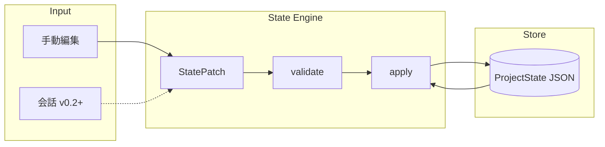

# GROUND Core v0.1 — Project Graph / State Engine 設計

> **地位**: GROUND 本体（ground.ink）とは別系統。さく個人用「思考 OS」の中核。  
> **v0.1 の位置づけ**: 設計のみ。実装は次フェーズ。

---

## 0. 設計思想

### GROUND Core が保存するもの

| 比喩 | 保存する | 保存しない |
|------|----------|------------|
| 幹 | Project・Goal・Current State | — |
| 枝 | Blocker・Next Action・Decision・Hypothesis | — |
| 葉 | — | 会話全文・発言ログ・生の LLM 入出力 |

**GROUND Core はチャット履歴管理ではない。**  
会話は「入力源」に過ぎず、永続化するのは **Project State**（目的・現在地・障害・次の一手）だけ。

### GROUND 本体との関係

```
┌─────────────────────┐         ┌─────────────────────┐
│  GROUND 本体         │         │  GROUND Core         │
│  (ground.ink)        │         │  (個人思考 OS)        │
│                     │         │                     │
│  会話 UI             │  ──►   │  State 抽出・保存     │
│  思考を整理する       │  patch │  Project Graph       │
│  答えを出さない       │         │  State Engine        │
└─────────────────────┘         └─────────────────────┘
        葉を扱う                         幹・枝を扱う
```

---

## 1. 全体アーキテクチャ

### 1.1 レイヤ構成

```
┌──────────────────────────────────────────────────────────────┐
│  Interface Layer (将来)                                       │
│  CLI / Web UI / GROUND 本体からの patch API                    │
└────────────────────────────┬─────────────────────────────────┘
                             │
┌────────────────────────────▼─────────────────────────────────┐
│  Extraction Layer (v0.2+)                                     │
│  Conversation → StatePatch  （LLM / ルール）                    │
│  ※ v0.1 では手動 patch のみ想定                                 │
└────────────────────────────┬─────────────────────────────────┘
                             │
┌────────────────────────────▼─────────────────────────────────┐
│  State Engine (v0.1 コア)                                     │
│  - validate(patch)                                            │
│  - apply(patch) → ProjectState                                │
│  - resolve active next_actions / open blockers                │
│  - bump updated_at (entity + aggregate)                       │
└────────────────────────────┬─────────────────────────────────┘
                             │
┌────────────────────────────▼─────────────────────────────────┐
│  Project Graph Store (v0.1)                                   │
│  - 1 Project = 1 JSON ドキュメント（ファイル or 単一 DB row）    │
│  - 将来: PostgreSQL 正規化テーブルへ 1:1 マップ                 │
└────────────────────────────┬─────────────────────────────────┘
                             │
┌────────────────────────────▼─────────────────────────────────┐
│  Extension Hooks (v0.1 では型・予約フィールドのみ)              │
│  - Goal Graph edges                                           │
│  - AI Router context                                          │
│  - State revision / audit log                                 │
└──────────────────────────────────────────────────────────────┘
```

### 1.2 データフロー（v0.1）



### 1.3 拡張前提（v0.1 では未実装）

| 拡張 | 前提として v0.1 で確保すること |
|------|------------------------------|
| **Goal Graph** | `goals[].parent_goal_id` + 予約 `goal_edges[]` |
| **AI Router** | `project_id` をコンテキストキーに、`extensions.router` 予約 |
| **PostgreSQL** | UUID PK、ISO8601、`project_id` FK 一貫、正規化可能なフラット配列 |
| **監査** | 各 entity の `updated_at` + 予約 `revision` |

---

## 2. データモデル

### 2.1 エンティティ一覧

| Entity | 役割 | Cardinality (Project あたり) |
|--------|------|-------------------------------|
| **Project** | 思考の容器・幹 | 1（ドキュメント root） |
| **Goal** | 到達したい状態・枝の方向 | 0..n（木 or 将来 DAG） |
| **CurrentState** | 今どこにいるか | 1（必須） |
| **Blocker** | 進めない理由 | 0..n |
| **NextAction** | 次の一手 | 0..n（active は少数推奨） |
| **Decision** | 決めたことと理由 | 0..n |
| **Hypothesis** | 検証中の仮説 | 0..n |
| **updated_at** | 各 entity + aggregate | 全 entity + root |

### 2.2 Project

```typescript
type ProjectStatus = "active" | "paused" | "archived" | "completed";

interface Project {
  id: string;              // UUID v4
  title: string;           // 短い名称
  summary: string;         // 1〜3文の幹説明
  status: ProjectStatus;
  created_at: string;      // ISO 8601 UTC
  updated_at: string;
  tags?: string[];         // 任意、将来の Router 用
}
```

### 2.3 Goal（Goal Graph 拡張前提）

```typescript
type GoalStatus =
  | "proposed"   // 候補
  | "active"     // 今追っている
  | "achieved"   // 達成
  | "deferred"   // 後回し
  | "abandoned"; // やめた

interface Goal {
  id: string;
  project_id: string;
  parent_goal_id: string | null;  // 木構造。null = ルート goal
  title: string;
  description: string;
  status: GoalStatus;
  priority: 1 | 2 | 3 | 4 | 5;    // 1 = 最高
  sort_order: number;
  created_at: string;
  updated_at: string;
}

// v0.2+ Goal Graph 用（v0.1 では空配列で OK）
interface GoalEdge {
  id: string;
  project_id: string;
  from_goal_id: string;
  to_goal_id: string;
  edge_type: "subgoal_of" | "depends_on" | "blocks" | "supports";
  created_at: string;
}
```

### 2.4 CurrentState

```typescript
interface CurrentState {
  id: string;
  project_id: string;
  primary_goal_id: string | null;  // 今フォーカスしている goal
  summary: string;                 // 「今ここ」の一文
  phase: string | null;            // 例: "design" | "implementation" | "review"
  confidence: number | null;       // 0.0〜1.0、任意
  updated_at: string;
}
```

### 2.5 Blocker

```typescript
type BlockerSeverity = "low" | "medium" | "high" | "critical";
type BlockerStatus = "open" | "mitigated" | "resolved" | "accepted";

interface Blocker {
  id: string;
  project_id: string;
  goal_id: string | null;
  title: string;
  description: string;
  severity: BlockerSeverity;
  status: BlockerStatus;
  created_at: string;
  updated_at: string;
}
```

### 2.6 NextAction

```typescript
type NextActionStatus = "pending" | "in_progress" | "done" | "cancelled";

interface NextAction {
  id: string;
  project_id: string;
  goal_id: string | null;
  blocker_id: string | null;       // この blocker を解除する action
  title: string;
  description: string | null;
  status: NextActionStatus;
  due_at: string | null;           // ISO 8601 date or datetime
  sort_order: number;              // 小さいほど先
  created_at: string;
  updated_at: string;
}
```

### 2.7 Decision

```typescript
type DecisionStatus = "active" | "superseded" | "reversed";

interface Decision {
  id: string;
  project_id: string;
  goal_id: string | null;
  title: string;
  rationale: string;
  alternatives_considered: string[];
  status: DecisionStatus;
  decided_at: string;
  created_at: string;
  updated_at: string;
}
```

### 2.8 Hypothesis

```typescript
type HypothesisStatus = "untested" | "testing" | "validated" | "invalidated";

interface Hypothesis {
  id: string;
  project_id: string;
  goal_id: string | null;
  statement: string;
  status: HypothesisStatus;
  evidence_for: string[];
  evidence_against: string[];
  created_at: string;
  updated_at: string;
}
```

### 2.9 Aggregate Root: ProjectState

```typescript
interface ProjectState {
  schema_version: "0.1.0";
  project: Project;
  goals: Goal[];
  current_state: CurrentState;
  blockers: Blocker[];
  next_actions: NextAction[];
  decisions: Decision[];
  hypotheses: Hypothesis[];

  // 拡張用（v0.1 では空で OK）
  goal_edges: GoalEdge[];
  extensions: {
    router?: Record<string, unknown>;
    [key: string]: unknown;
  };

  updated_at: string;  // aggregate の最終更新（全 entity の max）
}
```

### 2.10 StatePatch（State Engine 入出力）

v0.1 では **upsert / status_change / delete** の 3 操作で十分。

```typescript
type PatchOp = "upsert" | "status_change" | "delete";

interface StatePatch {
  schema_version: "0.1.0";
  project_id: string;
  source: "manual" | "extraction" | "import";
  operations: PatchOperation[];
  applied_at?: string;  // apply 後に付与
}

interface PatchOperation {
  op: PatchOp;
  entity: "goal" | "current_state" | "blocker" | "next_action" | "decision" | "hypothesis" | "project";
  entity_id: string;
  payload?: Partial<Goal | CurrentState | Blocker | NextAction | Decision | Hypothesis | Project>;
  status?: string;      // status_change 用
}
```

---

## 3. PostgreSQL 移行マップ

v0.1 JSON は **1 Project = 1 行（JSONB）** でも **正規化テーブル** でも同じ schema で読める。

### 3.1 推奨テーブル（将来）

```sql
-- 全テーブル共通: id UUID PK, project_id UUID FK, created_at/updated_at TIMESTAMPTZ

projects
goals              -- parent_goal_id UUID NULL REFERENCES goals(id)
goal_edges         -- v0.2+
current_states     -- project あたり 1 active（UNIQUE project_id WHERE ...）
blockers
next_actions       -- blocker_id, goal_id nullable FK
decisions
hypotheses

-- 任意: 監査
state_revisions    -- project_id, snapshot JSONB, revision INT
patch_log          -- source, operations JSONB, applied_at
```

### 3.2 移行方針

1. v0.1: `storage/ground-core/projects/{project_id}.json`
2. v0.3: `projects` テーブル + JSONB カラム `state`（デュアルライト）
3. v0.4: 正規化テーブルへ split、`ProjectState` は read model として VIEW or アプリ層で assemble

### 3.3 命名規則（PG 互換）

- フィールド名: `snake_case`（JSON / PG 一致）
- ID: UUID v4 文字列
- 時刻: ISO 8601 UTC（`2026-06-07T12:34:56.789Z`）
- enum: 文字列リテラル（PG では `TEXT` + CHECK または ENUM 型）

---

## 4. JSON Schema

ファイル: `docs/schemas/ground-core-project-state.v0.1.schema.json`

（本文末尾に完全版を同梱）

---

## 5. JSON 例

### 5.1 新規 Project（最小）

```json
{
  "schema_version": "0.1.0",
  "project": {
    "id": "a1b2c3d4-e5f6-7890-abcd-ef1234567890",
    "title": "GROUND Core v0.1",
    "summary": "会話ではなく Project State を保存する個人思考 OS の最小核を設計する。",
    "status": "active",
    "created_at": "2026-06-07T10:00:00.000Z",
    "updated_at": "2026-06-07T10:00:00.000Z"
  },
  "goals": [
    {
      "id": "b2c3d4e5-f6a7-8901-bcde-f12345678901",
      "project_id": "a1b2c3d4-e5f6-7890-abcd-ef1234567890",
      "parent_goal_id": null,
      "title": "v0.1 設計を完了する",
      "description": "データモデル・JSON Schema・State Engine インターフェースを確定する。",
      "status": "active",
      "priority": 1,
      "sort_order": 0,
      "created_at": "2026-06-07T10:00:00.000Z",
      "updated_at": "2026-06-07T10:00:00.000Z"
    }
  ],
  "current_state": {
    "id": "c3d4e5f6-a7b8-9012-cdef-123456789012",
    "project_id": "a1b2c3d4-e5f6-7890-abcd-ef1234567890",
    "primary_goal_id": "b2c3d4e5-f6a7-8901-bcde-f12345678901",
    "summary": "設計ドキュメント作成中。実装はまだ着手しない。",
    "phase": "design",
    "confidence": 0.85,
    "updated_at": "2026-06-07T12:00:00.000Z"
  },
  "blockers": [],
  "next_actions": [
    {
      "id": "d4e5f6a7-b8c9-0123-def0-234567890123",
      "project_id": "a1b2c3d4-e5f6-7890-abcd-ef1234567890",
      "goal_id": "b2c3d4e5-f6a7-8901-bcde-f12345678901",
      "blocker_id": null,
      "title": "JSON Schema ファイルをリポジトリに置く",
      "description": null,
      "status": "pending",
      "due_at": null,
      "sort_order": 0,
      "created_at": "2026-06-07T12:00:00.000Z",
      "updated_at": "2026-06-07T12:00:00.000Z"
    }
  ],
  "decisions": [
    {
      "id": "e5f6a7b8-c9d0-1234-ef01-345678901234",
      "project_id": "a1b2c3d4-e5f6-7890-abcd-ef1234567890",
      "goal_id": "b2c3d4e5-f6a7-8901-bcde-f12345678901",
      "title": "v0.1 は JSON ファイルストアから始める",
      "rationale": "PostgreSQL は設計だけ先に固め、実装コストを抑える。",
      "alternatives_considered": ["最初から Supabase", "SQLite"],
      "status": "active",
      "decided_at": "2026-06-07T11:00:00.000Z",
      "created_at": "2026-06-07T11:00:00.000Z",
      "updated_at": "2026-06-07T11:00:00.000Z"
    }
  ],
  "hypotheses": [
    {
      "id": "f6a7b8c9-d0e1-2345-f012-456789012345",
      "project_id": "a1b2c3d4-e5f6-7890-abcd-ef1234567890",
      "goal_id": "b2c3d4e5-f6a7-8901-bcde-f12345678901",
      "statement": "会話から週1回 state を更新すれば、チャット履歴なしで文脈を維持できる",
      "status": "untested",
      "evidence_for": [],
      "evidence_against": [],
      "created_at": "2026-06-07T11:30:00.000Z",
      "updated_at": "2026-06-07T11:30:00.000Z"
    }
  ],
  "goal_edges": [],
  "extensions": {},
  "updated_at": "2026-06-07T12:00:00.000Z"
}
```

### 5.2 StatePatch 例（会話後に Blocker を追加する想定）

```json
{
  "schema_version": "0.1.0",
  "project_id": "a1b2c3d4-e5f6-7890-abcd-ef1234567890",
  "source": "manual",
  "operations": [
    {
      "op": "upsert",
      "entity": "blocker",
      "entity_id": "11111111-2222-3333-4444-555555555555",
      "payload": {
        "id": "11111111-2222-3333-4444-555555555555",
        "project_id": "a1b2c3d4-e5f6-7890-abcd-ef1234567890",
        "goal_id": "b2c3d4e5-f6a7-8901-bcde-f12345678901",
        "title": "State Engine の patch 競合方針が未決",
        "description": "楽観ロック vs  last-write-wins の選択が必要。",
        "severity": "medium",
        "status": "open",
        "created_at": "2026-06-07T13:00:00.000Z",
        "updated_at": "2026-06-07T13:00:00.000Z"
      }
    },
    {
      "op": "upsert",
      "entity": "current_state",
      "entity_id": "c3d4e5f6-a7b8-9012-cdef-123456789012",
      "payload": {
        "summary": "設計は固まった。patch 競合方針の Decision が必要。",
        "updated_at": "2026-06-07T13:00:00.000Z"
      }
    }
  ]
}
```

---

## 6. v0.1 で作る範囲

| # | 項目 | 内容 |
|---|------|------|
| 1 | **型定義** | `ProjectState` / 各 entity / `StatePatch` の TypeScript 型 |
| 2 | **JSON Schema** | バリデーション用 schema 2 本（State + Patch） |
| 3 | **State Engine** | `load` / `save` / `validatePatch` / `applyPatch` / `createEmptyProject` |
| 4 | **File Store** | `ground-core/projects/{id}.json` 読み書き |
| 5 | **CLI 最小** | `ground-core init` / `show` / `patch`（JSON ファイル入力） |
| 6 | **不変条件** | 必須 entity 存在、FK 整合、`updated_at` 自動更新 |
| 7 | **テスト** | patch apply、schema validate、FK 破損検知 |

### v0.1 State Engine 不変条件

1. `current_state` は常に 1 つ
2. 全 child entity の `project_id` は root `project.id` と一致
3. `goal_id` / `blocker_id` 参照は同一 project 内のみ
4. `parent_goal_id` は自己参照・循環禁止
5. `applyPatch` 後、`ProjectState.updated_at` = 全 entity の max(`updated_at`)

---

## 7. v0.1 で作らない範囲

| 項目 | 理由 | 将来バージョン |
|------|------|----------------|
| 会話ログ保存 | 葉は保存しない | — |
| LLM による自動抽出 | Extraction Layer | v0.2 |
| GROUND 本体との API 連携 | 個人 OS は独立 | v0.2+ |
| AI Router | `extensions.router` のみ予約 | v0.3 |
| Goal Graph（DAG edges） | `goal_edges[]` 空で OK | v0.3 |
| PostgreSQL / Supabase | 設計のみ先出し | v0.3〜 |
| 認証・マルチユーザー | さく個人用 | 必要時 |
| Web UI | CLI で十分 | v0.2+ |
| リアルタイム同期 | 単一ユーザー file store | 将来 |
| state_revisions 履歴 | patch_log 未実装 | v0.4 |
| Project 間グラフ | 単一 Project 中心 | v0.4+ |

---

## 8. 次に実装する場合の手順

### Phase A — スキャフォールド（1〜2 日）

1. `ground-core/` ディレクトリを GROUND 本体と分離して作成（`sister-standalone` と同様の分離思想）
2. `src/types/projectState.ts` — 本 doc §2 の型
3. `docs/schemas/ground-core-project-state.v0.1.schema.json` — JSON Schema
4. `src/engine/validate.ts` — Ajv で State / Patch 検証
5. 単体テスト: 最小 JSON 例が schema を通ること

### Phase B — State Engine（2〜3 日）

1. `src/engine/projectStateEngine.ts`
   - `createEmptyProject(title)`
   - `loadProject(id)` / `saveProject(state)`
   - `validatePatch(state, patch)`
   - `applyPatch(state, patch)` — immutable return
2. `src/store/fileProjectStore.ts`
3. テスト: Patch 例 §5.2 が正しく merge されること
4. テスト: FK 違反 patch が reject されること

### Phase C — CLI（1 日）

```bash
ground-core init "My Project"
ground-core show <project-id>
ground-core patch <project-id> ./patch.json
ground-core list
```

### Phase D — 手動運用で検証（1 週間）

1. 実プロジェクト 1 件を GROUND Core で管理
2. 会話後に手動で patch を書き、state が十分か検証
3. 不足フィールドを v0.1.1 として schema にのみ追加（後方互換）

### Phase E — v0.2 への橋渡し

1. Extraction Layer インターフェース草案（`ConversationDigest → StatePatch`）
2. GROUND 本体に「Project に送る」ボタンは **patch プレビューのみ**（保存は Core 側）
3. Goal Graph / Router の ADR を 1 ページで書く

---

## 9. 推奨ディレクトリ構成（実装時）

```
ground-core/
├── package.json
├── src/
│   ├── types/
│   │   └── projectState.ts
│   ├── engine/
│   │   ├── validate.ts
│   │   ├── applyPatch.ts
│   │   └── projectStateEngine.ts
│   ├── store/
│   │   └── fileProjectStore.ts
│   └── cli/
│       └── index.ts
├── storage/              # gitignore
│   └── projects/
└── tests/
    └── engine.test.ts
```

---

## 10. 関連ドキュメント

- GROUND 本体: `README.md` — 思考整理 UI（葉）
- SISTER Thought OS: `sister-standalone/src/lib/sisterThoughtOS.ts` — ドメイン特化 State の参考
- CLI v0.1: [GROUND_CORE_CLI_V0.1.md](./GROUND_CORE_CLI_V0.1.md)
- v0.1.1 変更点: [GROUND_CORE_V0.1.1.md](./GROUND_CORE_V0.1.1.md)
- 本設計 JSON Schema: `docs/schemas/ground-core-project-state.v0.1.schema.json`
