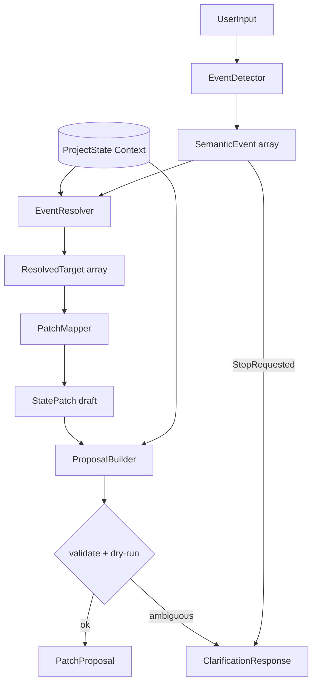

# GROUND Core v0.2.1 — Semantic Extraction Layer 設計

> **地位**: v0.2 MockExtractor の進化版。**固有名詞・固定例に依存しない** Event 抽出層。  
> **v0.2.1 の位置づけ**: **設計のみ**。実装・LLM API・自動保存は **行わない**。

---

## 0. なぜ v0.2.1 が必要か

### v0.2 の問題（固定例依存）

v0.2 MockExtractor は次のような **入力例のルール化** に依存している。

| 悪いパターン | 例 |
|--------------|-----|
| 固有名詞 + キーワード | 「新宿中央公園」→ FreeWater 配布場所 |
| プロジェクト名 + キーワード | FreeWater + 「場所」 |
| 制作固有名 + キーワード | Momotaro + 「キャラ固定」 |

これは SISTER 時代と同型の設計リスクである。

- 「イオン」だから株  
- 「一次関数」だから数学  
- 「新宿中央公園」だから FreeWater  

**入力例が増えるたびに if 分岐が増え、汎用 Extraction Layer にならない。**

### v0.2.1 の解決方針

入力文の **固有名詞** ではなく、**何が起きたか（Semantic Event）** を抽出する。

| 悪い設計 | 良い設計 |
|----------|----------|
| 新宿中央公園だから FreeWater の場所 | **場所候補が発生した** |
| 桃太郎だからキャラ固定 | **優先順位が変わった** |
| 一次関数だから数学 | **学習対象に関する決定** |
| イオンだから株 | **投資対象に関する候補** |

Project 固有の語（blocker title、next_action title）は **Context（解決用）** として使う。  
抽出の **核** にはしない。

---

## 1. v0.2.1 の全体思想

### 1.1 三層分離

```
UserInput + ProjectState(Context)
        ↓
  EventDetector          ← 固有名詞非依存。言語模態・イベント種別のみ
        ↓
  SemanticEvent[]        ← 中間表現（永続化しない）
        ↓
  EventResolver          ← ProjectState から entity_id を解決
        ↓
  PatchMapper            ← SemanticEvent → StatePatch operations
        ↓
  ProposalBuilder        ← v0.2 既存（validate + dry-run）
        ↓
  PatchProposal | ClarificationResponse
```

**EventDetector** は「何が起きたか」を言う。  
**EventResolver** は「どの blocker / action に当てるか」を ProjectState から決める。  
**PatchMapper** は event type + resolved entity から patch operation を組み立てる。

### 1.2 絶対ルール（v0.2 継承 + 追加）

| # | ルール |
|---|--------|
| R1 | 自動保存しない |
| R2 | LLM 生出力をそのまま保存しない |
| R3 | validateStatePatch + dry-run applyPatch 必須 |
| R4 | requires_human_approval は常に true |
| R5 | project.status 自動変更禁止 |
| R6 | delete operation 禁止 |
| R7 | **固有名詞を SemanticEvent の主語にしない** |
| R8 | **入力例を if ルール化しない**（テスト fixture は可、production ルールは不可） |
| R9 | **Modality（ intent / commitment / completed ）を confidence に反映** |
| R10 | StopRequested は ClarificationResponse 優先 |

### 1.3 Context の位置づけ

ProjectState は **解決のための辞書** である。

```
SemanticEvent: DecisionMade, target_kind: location, modality: intent
        +
Context: open blocker whose role=location OR next_action about location selection
        →
Resolved: blocker_id f222...201, next_action_id f333...301
```

「配布場所」「新宿中央公園」は **observation.body に原文として残してよい**。  
EventDetector の **分類根拠** には使わない。

---

## 2. SemanticEvent 型案

```typescript
/** ドメイン非依存の意味イベント種別 */
export type SemanticEventType =
  | "CandidateCreated"      // 候補・案が出た（未確定）
  | "DecisionMade"          // 決定・確定（commitment）
  | "ActionCompleted"       // 行動完了
  | "ActionDeferred"        // 延期・後回し
  | "BlockerDiscovered"     // 障害の発見
  | "BlockerMitigated"      // 障害の緩和・解消候補
  | "ObservationRecorded"   // 観測・メモ
  | "PriorityChanged"       // 優先順位・焦点の変更
  | "HypothesisCreated"     // 仮説の追加
  | "JudgmentMade"          // Go/Stop/Hold/Revise 判定
  | "StopRequested"         // 中止意向（高リスク）
  | "RevisionRequested";    // 方針修正意向

/** イベント対象の抽象カテゴリ（固有名詞ではない） */
export type SemanticTargetKind =
  | "location"              // 場所・会場・配布点
  | "next_action"           // 次の一手・タスク焦点
  | "blocker"               // 障害・未確定事項
  | "goal"                  // 目標
  | "resource"              // 資材・道具・人数
  | "timeline"              // 期限・スケジュール
  | "production_subject"    // 制作対象（キャラ・シーン等）
  | "learning_subject"      // 学習対象
  | "investment_subject"    // 投資対象
  | "process_rule"          // 手順・ルール・運用
  | "unknown";

/** 発話の確度・時制（confidence 算出に使う） */
export type SemanticModality =
  | "intent"        // 〜しようと思う、検討中
  | "plan"          // 〜する予定、〜にするつもり
  | "commitment"    // 〜に決めた、〜にする（確定）
  | "completed"     // 〜した、完了した
  | "deferred"      // 後で、もう少し考える
  | "negative"      // やめたい、無理（Stop/Revision 系）
  | "unknown";

export interface SemanticEvent {
  /** event 自体の id（new-id、永続化しない） */
  id: string;
  type: SemanticEventType;
  target_kind: SemanticTargetKind;
  modality: SemanticModality;
  /** 0.0–1.0。type + modality + evidence 強度から算出 */
  confidence: number;
  /** 言語手がかり（例: "しようと思う", "決めた"）。固有名詞は evidence に入れない */
  evidence: string[];
  /** 原文抜粋（observation 用。固有名詞はここにのみ） */
  raw_span?: string;
  /** EventResolver へのヒント（role ベース。固有名詞禁止） */
  resolver_hint?: SemanticResolverHint;
}

/** ProjectState 上の entity 解決ヒント（role / slot ベース） */
export interface SemanticResolverHint {
  /** 解決戦略 */
  strategy:
    | "open_blocker_by_role"     // role=location, severity=high 等
    | "pending_action_by_role"   // role=location_selection, role=primary_focus
    | "primary_next_action"
    | "next_action_by_sort"
    | "linked_blocker_of_action"
    | "none";
  /** 抽象 role（ProjectState extensions または convention で定義） */
  role?: string;
  /** sort_order オフセット（+1 = 次の action） */
  sort_offset?: number;
}
```

### SemanticExtractionResult（EventDetector 出力）

```typescript
export interface SemanticExtractionResult {
  events: SemanticEvent[];
  /** 入力全体の ambiguity */
  ambiguity_level: "low" | "medium" | "high";
  /** Detector が使った modality 要約 */
  dominant_modality: SemanticModality;
  /** 原文（監査用） */
  raw_input: string;
  created_at: string;
}
```

---

## 3. SemanticEventType 一覧

| Type | 意味 | 典型 modality | 高リスク |
|------|------|---------------|----------|
| `CandidateCreated` | 候補・案の発生 | intent, plan | low |
| `DecisionMade` | 決定・確定 | commitment | medium |
| `ActionCompleted` | 行動完了 | completed, commitment | medium |
| `ActionDeferred` | 延期・保留 | deferred | low |
| `BlockerDiscovered` | 新障害 | — | medium |
| `BlockerMitigated` | 障害緩和 | commitment, completed | medium |
| `ObservationRecorded` | 観測記録 | any | low |
| `PriorityChanged` | 焦点・優先変更 | plan, commitment | low |
| `HypothesisCreated` | 仮説追加 | intent | low |
| `JudgmentMade` | 判定 | commitment | high |
| `StopRequested` | 中止意向 | negative | **high** |
| `RevisionRequested` | 方針修正意向 | negative, deferred | high |

---

## 4. EventDetector の責務

### 4.1 Interface

```typescript
export interface EventDetector {
  readonly name: string; // "rule-modality-v1" | 将来 "llm-v1"
  detect(input: ExtractionInput): SemanticExtractionResult;
}
```

### 4.2 やること

1. **Modality 検出** — 「しようと思う」「決めた」「後で」「やめたい」等の **言語パターン**
2. **Event type 分類** — modality + 抽象述語（場所・優先・停止）から type を決定
3. **target_kind 推定** — 「場所」「配布」「会場」→ `location`（**地名は target にしない**）
4. **confidence 付与** — modality が weak（intent）なら ActionCompleted を出さない
5. **evidence 列挙** — 判断根拠を **言語特征** で記録

### 4.3 やらないこと

- ProjectState の entity_id を決定しない（EventResolver の仕事）
- StatePatch を組み立てない（PatchMapper の仕事）
- 固有名詞マッチで event type を決めない
- 「FreeWater」「桃太郎」で分岐しない
- project.status を event に含めない

### 4.4 v0.2.1 初期 Detector（設計）

**RuleModalityDetector** — LLM なし。以下のみ許可:

| 検出対象 | 方法 | 例 |
|----------|------|-----|
| modality | 正規表現 / 助動詞パターン | しようと思う → intent |
| stop/revise | negative 語彙 | やめたい、無理 → StopRequested |
| defer | deferred 語彙 | 後で、もう少し考える → ActionDeferred |
| location slot | 抽象語彙 | 場所、会場、配布点 → target_kind: location |
| priority slot | 抽象語彙 | まず、優先、からやる → PriorityChanged |
| decision vs candidate | modality 強度 | 決めた → DecisionMade; しようと思う → CandidateCreated |

**禁止**: `input.includes("新宿中央公園")` のようなルール。

---

## 5. SemanticEvent → StatePatch 変換方針

### 5.1 パイプライン

```
SemanticEvent[]
  → EventResolver.resolve(event, project_state) → ResolvedTarget[]
  → PatchMapper.map(resolved[]) → StatePatch draft
  → ProposalBuilder (v0.2)
```

### 5.2 ResolvedTarget

```typescript
export interface ResolvedTarget {
  event: SemanticEvent;
  entity?: {
    kind: PatchEntity;
    id: string;
    label: string; // ProjectState から取得した title
  };
  resolution_confidence: number;
  unresolved_reason?: string;
}
```

### 5.3 変換原則

| 原則 | 説明 |
|------|------|
| **Modality gate** | intent の DecisionMade だけでは ActionCompleted を生成しない |
| **Observation 必須** | ほぼ全 event で ObservationRecorded を併記（raw_span 保持） |
| **Resolver 失敗** | patch ではなく ClarificationResponse |
| **複数 event** | 同一入力から複数 event 可。operation 上限 8 |
| **StopRequested** | patch 生成前に ClarificationResponse に切り替え |
| **JudgmentMade** | outcome は hold/revise 候補のみ自動。stop/go は clarification |

### 5.4 Event → Patch 対応表

| SemanticEvent | Modality 条件 | Patch operations（候補） | Resolver hint |
|---------------|---------------|--------------------------|-----------------|
| `CandidateCreated` | intent, plan | observation upsert | role=location 等 |
| `DecisionMade` | commitment | observation upsert | — |
| `DecisionMade` | commitment + location | + blocker mitigated? + action done? + primary shift | open_blocker_by_role: location |
| `ActionCompleted` | completed | next_action status_change: done | pending_action_by_role |
| `ActionCompleted` | **not** completed | **生成しない** | — |
| `ActionDeferred` | deferred | observation upsert; optional judgment hold | primary 維持 |
| `BlockerDiscovered` | — | blocker upsert（v0.2.1 では clarification 推奨） | — |
| `BlockerMitigated` | commitment | blocker status_change: mitigated/resolved | open_blocker_by_role |
| `ObservationRecorded` | any | observation upsert | none |
| `PriorityChanged` | plan, commitment | current_state primary_next_action_id | pending_action_by_role: focus |
| `HypothesisCreated` | intent | hypothesis upsert（v0.2.1 後半 or clarification） | — |
| `JudgmentMade` | commitment | judgment upsert outcome: hold/revise | — |
| `StopRequested` | negative | **ClarificationResponse のみ** | — |
| `RevisionRequested` | negative, deferred | observation + judgment revise 候補 or clarification | — |

### 5.5 Modality gate 詳細（例1 vs 例2）

**例1**: 「配布場所、新宿中央公園に**しようと思う**」

| 段階 | 出力 |
|------|------|
| EventDetector | CandidateCreated(location, intent) + ObservationRecorded |
| ActionCompleted | **出さない** |
| BlockerMitigated | **出さない**（intent 不足） |
| confidence | 中程度（~0.55–0.70） |

**例2**: 「配布場所は新宿中央公園に**決めた**」

| 段階 | 出力 |
|------|------|
| EventDetector | DecisionMade(location, commitment) + ObservationRecorded |
| PatchMapper | observation + blocker mitigated + action done + primary shift |
| confidence | 高め（~0.80–0.90） |

---

## 6. v0.2 MockExtractor との違い

| 観点 | v0.2 MockExtractor | v0.2.1 Semantic Layer |
|------|-------------------|------------------------|
| 分岐軸 | プロジェクト名 + キーワード | modality + event type + target_kind |
| 地名 | 「新宿中央公園」ルール | target_kind: location |
| 制作 | 「キャラ固定」ルール | PriorityChanged + role: focus |
| 停止 | 「やめる」キーワード | StopRequested + modality: negative |
| entity 解決 | title 部分一致ハードコード | EventResolver + role/slot |
| 中間表現 | なし（直接 patch） | SemanticEvent[] |
| テスト | 固定入力 3 例 | event type + modality 行列 |
| 拡張 | 例が増えると if 増殖 | Detector / Resolver / Mapper 独立 |

---

## 7. 固定例依存を避けるルール

### 7.1 設計ルール

| ID | ルール |
|----|--------|
| F1 | EventDetector に **プロジェクト名・地名・人名・銘柄名** を条件に使わない |
| F2 | EventDetector に **v0.2 テスト入力文** を条件に使わない |
| F3 | target_kind は **抽象カテゴリ enum** のみ |
| F4 | entity_id 解決は **ProjectState + role convention** のみ |
| F5 | observation.body に固有名詞を残すのは **可**（原文保存） |
| F6 | resolver role は **extensions または doc convention** で定義（ハードコード title 禁止） |
| F7 | 新 project 追加時、Detector コード変更 **不要** が完了条件 |
| F8 | コードレビューで `includes("新宿")` 等を **拒否** |

### 7.2 Role Convention 案（Context 解決）

ProjectState の blocker / next_action に **role** を付与（v0.2.1 実装時 options）:

| role | 解決対象 |
|------|----------|
| `location_selection` | 場所未定 blocker + 場所決定 action |
| `primary_focus` | current primary_next_action または sort_order 最小 pending |
| `focus:*` | ユーザーが「まず X」と言った時、X に相当する action を semantic match（将来 LLM） |

v0.2.1 初期は **blocker↔action の blocker_id リンク** + **sort_order** で location slot を解決（title 文字列マッチ最小化）。

### 7.3 固定例依存防止チェックリスト（PR 用）

- [ ] EventDetector に固有名詞リテラルがない
- [ ] テスト入力文が production コードにコピーされていない
- [ ] event type は modality テストで検証されている
- [ ] 新 project fixture で E2E が通る（Detector 変更なし）
- [ ] FreeWater / Momotaro 固有語が Detector 層にない

---

## 8. 危険パターン

| # | パターン | 期待動作 |
|---|----------|----------|
| S1 | intent を completed と誤分類 | ActionCompleted を出さない。confidence 下げる |
| S2 | StopRequested を DecisionMade と混同 | ClarificationResponse。project.status 変更なし |
| S3 | 地名から project 推定 | 禁止。project_id は CLI 明示 |
| S4 | 単一 event から 10+ operations | operation 上限 8 で reject |
| S5 | BlockerMitigated without DecisionMade | modality gate で抑制 |
| S6 | PriorityChanged で存在しない action | Resolver 失敗 → clarification |
| S7 | JudgmentMade outcome: stop 自動 | 禁止。clarification |
| S8 | 固有名詞のみの入力（「新宿中央公園」） | target_kind 不明 → clarification |
| S9 | 複数 project 語混在 | clarification |
| S10 | Resolver が title 完全一致のみ | F6 違反。role / graph 優先 |

---

## 9. v0.2.1 で作る範囲

| 項目 | 内容 |
|------|------|
| 設計 doc | 本ファイル |
| 型案 | SemanticEvent, SemanticExtractionResult, ResolvedTarget |
| Interface | EventDetector, EventResolver, PatchMapper |
| 変換方針 | Event → Patch 対応表、Modality gate |
| 代表例テーブル | 5 入力例の event 期待 |
| チェックリスト | 固定例依存防止 |
| Role convention 案 | location_selection 等 |

**実装は v0.2.1 実装フェーズ** — 本ドキュメントでは設計のみ。

---

## 10. v0.2.1 で作らない範囲

| 項目 | 理由 |
|------|------|
| 実装 | 本フェーズは設計のみ |
| LLM API | v0.2.2+ |
| 自動保存 | 思想違反 |
| Web UI / Router / DB | 未着手 |
| Project 自動判定 | project_id CLI 明示継続 |
| Goal Graph 自動更新 | schema 外 |
| role フィールド schema 追加 | optional extensions で十分か要確認 |
| SemanticEvent 永続化 | 中間表現は非永続 |

---

## 11. 実装する場合のファイル構成案

```
ground-core/extraction/
  types.ts                          # 既存 PatchProposal 等
  semantic/
    types.ts                        # SemanticEvent, SemanticEventType, ...
    event-detector.ts               # EventDetector interface
    rule-modality-detector.ts       # v0.2.1 初期（LLM なし）
    event-resolver.ts               # ProjectState → ResolvedTarget
    patch-mapper.ts                 # ResolvedTarget[] → StatePatch
    modality-patterns.ts            # 言語パターン（固有名詞なし）
  mock-extractor.ts                 # v0.2 互換（deprecated 層 or 薄い wrapper）
  propose.ts                        # Semantic パイプライン接続
  dry-run.ts                        # 既存

ground-core/__tests__/
  semantic/
    event-detector.test.ts          # modality × type 行列
    event-resolver.test.ts          # role / sort 解決
    patch-mapper.test.ts            # Modality gate
    e2e-propose.test.ts             # 5 代表例（project fixture）

docs/
  GROUND_CORE_V0.2.1_SEMANTIC_EXTRACTION_DESIGN.md
  GROUND_CORE_V0.2.1_ROLE_CONVENTION.md   # optional 分割
```

CLI: `propose --detector rule-modality` フラグ（v0.2 mock フォールバック可）。

---

## 12. テスト方針

### 12.1 EventDetector 単体（固定例不使用）

**modality 行列テスト** — 入力は **合成文**（固有名詞ランダム化）:

| 文型 | 期待 type | 期待 modality |
|------|-----------|---------------|
| `{slot}にしようと思う` | CandidateCreated | intent |
| `{slot}に決めた` | DecisionMade | commitment |
| `まず{task}から` | PriorityChanged | plan |
| `もう少し考える` | ActionDeferred | deferred |
| `もう無理` | StopRequested | negative |

`{slot}` / `{task}` はパラメータ化。特定地名・プロジェクト名を使わない。

### 12.2 EventResolver 単体

- open blocker + blocker_id リンクで location slot 解決
- primary_next_action + sort_order で次 action 解決
- 解決不能 → unresolved_reason

### 12.3 PatchMapper + Modality gate

- intent の DecisionMade → observation のみ（done なし）
- commitment + location → full chain
- StopRequested → ClarificationResponse

### 12.4 E2E（代表 5 例 — fixture 使用可）

| # | 入力 | 期待 |
|---|------|------|
| 1 | FreeWater…しようと思う | CandidateCreated, confidence 中, no done |
| 2 | …決めた | DecisionMade, done + mitigated 候補 |
| 3 | まずキャラ固定 | PriorityChanged |
| 4 | もう少し考える | ActionDeferred or Judgment hold |
| 5 | もう無理、やめたい | StopRequested → clarification |

**E2E は fixture 名を使ってよいが、Detector テストは使わない。**

### 12.5 リグレッション

- v0.2 propose CLI 互換（--detector mock 維持）
- propose は saveProject しない
- 50+ tests 全通過

---

## 13. 代表例テーブル（設計検証用）

| 入力 | 期待 events | Patch 候補 | Clarification |
|------|-------------|------------|---------------|
| 配布場所、〇〇に**しようと思う** | CandidateCreated(location, intent), ObservationRecorded | observation のみ | 可（confidence 低） |
| 配布場所は〇〇に**決めた** | DecisionMade(location, commitment), ObservationRecorded | obs + blocker mitigated + action done + primary | 不要 |
| **まず**△△**からやる** | PriorityChanged(next_action, plan), ObservationRecorded | obs + primary shift | 不要 |
| **もう少し考える** | ActionDeferred, JudgmentMade(hold)? | obs + judgment hold 候補 | 可 |
| **もう無理、やめたい** | StopRequested(negative) | **なし** | **必須** |

〇〇 / △△ = 任意固有名詞（Detector は無視、observation.body のみ保持）

---

## 14. アーキテクチャ図（v0.2.1）



---

## 15. 実装に進む前の確認ポイント

1. **role convention** — blocker/next_action に role を extensions で持つか、sort_order + blocker_id リンクのみで十分か
2. **CandidateCreated vs DecisionMade 閾値** — intent の confidence 上限（ActionCompleted 禁止の境界）
3. **location slot 解決** — 複数 open blocker がある場合の優先順位
4. **PriorityChanged** — 「まず X から」を action title semantic match するか（v0.2.1 は sort 最小 pending でよいか）
5. **JudgmentMade 自動** — hold/revise のみ自動 proposal でよいか
6. **mock-extractor 扱い** — deprecated 削除 vs `--detector mock` 永続
7. **SemanticEvent を PatchProposal に embed するか** — デバッグ用 optional field
8. **BlockerDiscovered / HypothesisCreated** — v0.2.1 実装 scope に含めるか（clarification のみでも可）
9. **日本語 modality パターン** — ルールベース Detector の語彙リスト保守方針
10. **完了定義** — 新規 project fixture を追加しても EventDetector コード変更ゼロ

---

## 16. 関連ドキュメント

- [GROUND_CORE_V0.2_EXTRACTION_DESIGN.md](./GROUND_CORE_V0.2_EXTRACTION_DESIGN.md)
- [GROUND_CORE_V0.2_EXTRACTION.md](./GROUND_CORE_V0.2_EXTRACTION.md)
- [GROUND_CORE_V0.1.1.md](./GROUND_CORE_V0.1.1.md)

---

## 付録 A: SemanticEvent JSON 例（例1 — intent）

```json
{
  "events": [
    {
      "id": "evt-001",
      "type": "CandidateCreated",
      "target_kind": "location",
      "modality": "intent",
      "confidence": 0.62,
      "evidence": ["しようと思う", "場所"],
      "raw_span": "配布場所、新宿中央公園にしようと思う",
      "resolver_hint": {
        "strategy": "open_blocker_by_role",
        "role": "location_selection"
      }
    },
    {
      "id": "evt-002",
      "type": "ObservationRecorded",
      "target_kind": "unknown",
      "modality": "intent",
      "confidence": 0.85,
      "evidence": ["発話全体"],
      "raw_span": "配布場所、新宿中央公園にしようと思う"
    }
  ],
  "ambiguity_level": "medium",
  "dominant_modality": "intent"
}
```

## 付録 B: SemanticEvent JSON 例（例5 — StopRequested）

```json
{
  "events": [
    {
      "id": "evt-010",
      "type": "StopRequested",
      "target_kind": "unknown",
      "modality": "negative",
      "confidence": 0.88,
      "evidence": ["もう無理", "やめたい"],
      "raw_span": "もう無理、やめたい"
    }
  ],
  "ambiguity_level": "high",
  "dominant_modality": "negative"
}
```

→ PatchMapper は **patch を生成せず** ProposalBuilder が ClarificationResponse を返す。
