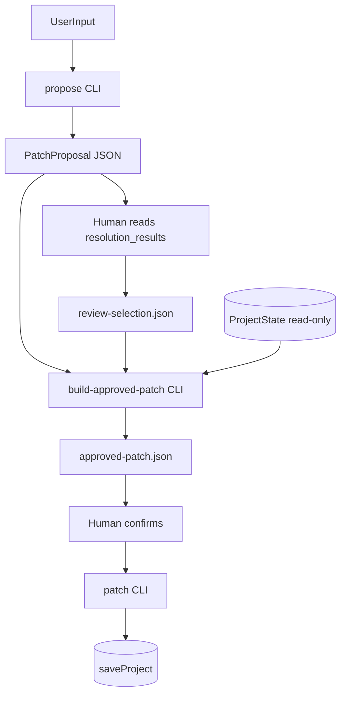

# GROUND Core v0.2.3 — Human Review Bridge 設計

> **地位**: v0.2.2 `resolution_results[]` で提示した候補を、人間が選択した **後** に `StatePatch` へ変換する橋渡し層。  
> **v0.2.3 の位置づけ**: **設計のみ**。実装・自動適用・LLM API は **行わない**。

前段: [GROUND_CORE_V0.2.2_EVENT_RESOLVER.md](./GROUND_CORE_V0.2.2_EVENT_RESOLVER.md)

---

## 0. 背景

### v0.2.2 まで

```
自然文
  → SemanticEvent
  → resolver_hint.raw_target_span
  → EventResolver
  → resolution_results[]
  → PatchProposal (observation / judgment のみ)
  → 【ここで止まる】
```

**例**: 「桃太郎はまずキャラ固定からやる」

| 段階 | 結果 |
|------|------|
| Event | `PriorityChanged` |
| Resolver | candidate: 「桃太郎のキャラクター固定ルールを整理する」 |
| PatchProposal | observation upsert のみ（primary 未更新） |

候補は出るが、**人間が選んだあとの StatePatch 生成がない**。

### v0.2.3 で追加

```
PatchProposal (+ resolution_results[])
        ↓
   Human Review（人間が候補を選ぶ）
        ↓
   ReviewSelection JSON
        ↓
   build-approved-patch
        ↓
   approved-patch.json（StatePatch）
        ↓
   人間が確認
        ↓
   既存 patch CLI で適用（saveProject）
```

**v0.2.3 の核心**: 人間の選択を **明示的な入力** として受け取り、approved patch **ファイルを生成するだけ**。  
`build-approved-patch` は ProjectState を **保存しない**。適用は既存 `patch` コマンドのみ。

---

## 1. v0.2.3 の全体思想

| 原則 | 説明 |
|------|------|
| **提案と承認の分離** | `propose` = 候補提示。`build-approved-patch` = 人間承認後の patch 生成 |
| **選択は外部入力** | `ReviewSelection` は人間（または将来 UI）が JSON で渡す。Resolver / propose は自動設定しない |
| **最小 state 進行** | v0.2.3 で許可する state 更新は **PriorityChanged + approve の primary 更新のみ** |
| **段階的 gate** | EventType × decision × entity status × ambiguity で patch 内容を決定 |
| **監査可能** | proposal_id / event_id / selection を approved patch bundle に残せる |
| **既存 CLI 再利用** | 出力は既存 `validateStatePatch` / `applyPatch` / `patch` と互換 |

### パイプライン（v0.2.3 全体）



### レイヤ責務

| レイヤ | 責務 | v0.2.3 |
|--------|------|--------|
| EventDetector | 意味イベント抽出 | 変更なし |
| EventResolver | next_action 候補提示 | 変更なし |
| semantic-propose | PatchProposal 生成 | 変更なし |
| **Human Review Bridge** | Selection → StatePatch | **新規** |
| patch CLI | StatePatch 適用 + 保存 | 変更なし |

---

## 2. ReviewSelection 型案

```typescript
/** v0.2.3 — 人間レビュー結果。proposal の resolution を確定する入力。 */
export interface ReviewSelection {
  schema_version: "0.2.3";
  proposal_id: string;
  project_id: string;
  event_id: string;

  /** resolution_results がある event で approve 時に必須 */
  selected_entity_type?: "next_action";
  selected_entity_id?: string;

  reviewer: "human";
  decision:
    | "approve_resolution"   // 解決を承認（EventType により patch 内容が変わる）
    | "reject_resolution"    // 解決を却下（state 進行なし patch）
    | "clarify";             // 保留（approved patch を出さない）

  note?: string;
  created_at: string; // ISO 8601
}
```

### フィールド規約

| フィールド | 必須条件 |
|-----------|---------|
| `proposal_id` | 常に必須。PatchProposal.id と一致 |
| `project_id` | 常に必須。PatchProposal.project_id と一致 |
| `event_id` | 常に必須。semantic_events[0].id または resolution_results[].event_id と一致 |
| `selected_entity_type` | `decision === approve_resolution` かつ resolution 対象 event で必須 |
| `selected_entity_id` | 同上 |
| `note` | 任意。ActionDeferred approve 時の observation 追記に使用可 |
| `reviewer` | v0.2.3 では `"human"` 固定 |

### 例: PriorityChanged 承認

```json
{
  "schema_version": "0.2.3",
  "proposal_id": "a1b2c3d4-....",
  "project_id": "839578f5-36e1-4b6f-9be5-a97520f52b66",
  "event_id": "evt-priority-001",
  "selected_entity_type": "next_action",
  "selected_entity_id": "c3333333-3333-4333-8333-333333333301",
  "reviewer": "human",
  "decision": "approve_resolution",
  "note": "キャラ固定を最優先にする",
  "created_at": "2026-06-07T12:00:00.000Z"
}
```

### 例: ActionDeferred 承認（primary は変えない）

```json
{
  "schema_version": "0.2.3",
  "proposal_id": "...",
  "project_id": "...",
  "event_id": "...",
  "selected_entity_type": "next_action",
  "selected_entity_id": "c3333333-3333-4333-8333-333333333304",
  "reviewer": "human",
  "decision": "approve_resolution",
  "note": "MJ文面は後回しで合意",
  "created_at": "..."
}
```

### 例: 却下

```json
{
  "schema_version": "0.2.3",
  "proposal_id": "...",
  "project_id": "...",
  "event_id": "...",
  "reviewer": "human",
  "decision": "reject_resolution",
  "note": "候補が違う。別 action を指している",
  "created_at": "..."
}
```

### resolution 不要 event 向け（CandidateCreated / DecisionMade）

`resolution_results` が空の proposal では `selected_entity_*` 不要。

```json
{
  "schema_version": "0.2.3",
  "proposal_id": "...",
  "project_id": "...",
  "event_id": "...",
  "reviewer": "human",
  "decision": "approve_resolution",
  "created_at": "..."
}
```

---

## 3. apply-selection / build-approved-patch の流れ

### 3.1 入力

| 入力 | 説明 |
|------|------|
| `proposal.json` | `propose` が出力した PatchProposal |
| `review-selection.json` | 人間が作成した ReviewSelection |
| `ProjectState`（読み取り） | CLI が storage から load。検証用。**保存しない** |

### 3.2 処理ステップ

```
1. Load PatchProposal + ReviewSelection
2. validateSelectionAgainstProposal()
   - proposal_id / project_id / event_id 整合
   - ClarificationResponse は不可
   - requires_human_approval === true
3. Load ProjectState (read-only)
4. resolveSemanticEvent(proposal, selection.event_id)
5. resolveResolutionResult(proposal, selection.event_id) // optional
6. assertReviewGates(proposal, selection, projectState, event, resolution)
7. switch (selection.decision):
     clarify     → ReviewBridgeClarification（patch 出力なし）
     reject      → buildRejectedPatch()（state 進行なし）
     approve     → buildApprovedPatch()（EventType 別）
8. assertApprovedPatchGates(approved_patch)
9. validateStatePatch(approved_patch)
10. dryRunPatch(projectState, approved_patch) // would_apply 確認
11. Write approved-patch.json（StatePatch）
    optional: --format bundle で監査 JSON
```

### 3.3 出力形式

**デフォルト (`--format state-patch`)**: 既存 `patch` CLI 互換の `StatePatch` のみ。

```json
{
  "schema_version": "0.1.1",
  "project_id": "...",
  "source": "human_review",
  "operations": [ "..."]
}
```

**オプション (`--format bundle`)**: 監査用ラッパ。

```typescript
export interface ApprovedPatchBundle {
  schema_version: "0.2.3";
  proposal_id: string;
  review_selection: ReviewSelection;
  approved_patch: StatePatch;
  semantic_event_type: SemanticEventType;
  gates_passed: string[];
  created_at: string;
}
```

`patch` CLI は引き続き `StatePatch` を受け取る。bundle 利用時は人間が `approved_patch` を取り出すか、将来 `--from-bundle` を追加。

### 3.4 PriorityChanged + approve_resolution の patch 合成

```
approved_patch.operations =
  proposal.proposed_patch.operations   // observation 維持
  + upsert current_state {
      ...existing current_state fields...,
      primary_next_action_id: selection.selected_entity_id
    }
```

`current_state` upsert は **merge payload** 方式。既存 `primary_goal_id` / `phase` / `summary` / `confidence` を ProjectState からコピーし、`primary_next_action_id` のみ上書き。

### 3.4 ActionDeferred + approve_resolution の patch 合成

```
approved_patch.operations =
  proposal.proposed_patch.operations   // observation + judgment hold
  // primary 更新なし
  // action status_change なし
  // optional: observation.body に selection.note を追記
```

observation 追記案（v0.2.3 採用可）:

```
{original body}

---
[human_review]
selected_next_action: {label} ({entity_id})
note: {selection.note}
```

追記は **approve_resolution かつ note または selected_entity_id がある場合のみ**。proposal 内 observation operation を特定して body を merge。

### 3.5 reject_resolution の patch 合成

```
approved_patch.operations =
  proposal.proposed_patch.operations のうち observation / judgment のみ
  // primary / status 変更なし
  // optional: observation.body に rejection note
```

「解決は却下したが、発話記録は残す」方針。

### 3.6 clarify の扱い

`decision === "clarify"` → **approved patch を生成しない**。

```typescript
export interface ReviewBridgeClarification {
  type: "clarification";
  reason: string;
  questions: string[];
  proposal_id: string;
  review_selection: ReviewSelection;
}
```

CLI exit code: `1`（propose clarification と同様）。

---

## 4. EventType 別 — 許可 patch 表

| EventType | resolution_results | selection 要否 | approve_resolution で許可する patch | primary 更新 | action status | blocker status |
|-----------|-------------------|----------------|--------------------------------------|-------------|---------------|----------------|
| `PriorityChanged` | あり | **要** | observation + current_state upsert | **可**（条件付き） | 禁止 | 禁止 |
| `ActionDeferred` | あり | **要** | observation + judgment hold (+ note 追記) | 禁止 | 禁止 | 禁止 |
| `CandidateCreated` | なし | 不要（approve のみ） | observation のみ | 禁止 | 禁止 | 禁止 |
| `DecisionMade` | なし | 不要（approve のみ） | observation + judgment hold | 禁止 | 禁止 | 禁止 |
| `StopRequested` | — | — | **対象外**（ClarificationResponse） | 禁止 | 禁止 | 禁止 |
| `ActionCompleted` | — | — | v0.2.3 未対応 | 禁止 | 禁止 | 禁止 |
| `BlockerMitigated` | — | — | v0.2.3 未対応 | 禁止 | 禁止 | 禁止 |

---

## 5. PriorityChanged → primary_next_action_id 更新の条件

**すべて満たす場合のみ** `current_state.primary_next_action_id` を更新:

| # | 条件 |
|---|------|
| 1 | `SemanticEvent.type === "PriorityChanged"` |
| 2 | `selection.decision === "approve_resolution"` |
| 3 | `selection.selected_entity_type === "next_action"` |
| 4 | `selection.selected_entity_id` が非空 |
| 5 | `selected_entity_id` が `ProjectState.next_actions` に存在 |
| 6 | 対象 action の `status === "pending"` |
| 7 | `selected_entity_id` が当該 proposal の `resolution_results[].candidates[]` に含まれる |
| 8 | 当該 resolution の `ambiguity_level !== "high"`（high は reject。`--force` は v0.2.3 非推奨・未実装） |
| 9 | `PatchProposal.requires_human_approval === true` |
| 10 | proposal 内 `proposed_patch` の observation operations を維持 |

**満たさない場合**: `ReviewBridgeError` で reject（approved patch 不出力）。

---

## 6. ActionDeferred → action status を変えない条件

| ルール | 説明 |
|--------|------|
| action status | **変更しない**（done / cancelled 禁止） |
| primary_next_action_id | **変更しない** |
| blocker status | **変更しない** |
| patch 内容 | proposal の observation + judgment hold をそのまま（+ 任意 note 追記） |
| selection の意味 | 「どの action を保留しているか」の **意味的確認**。state 優先度は動かさない |
| approve 条件 | PriorityChanged と同様に candidates 内存在 + pending 必須（解決確認） |
| reject | observation / judgment のみ。state 進行なし |

**設計判断**: ActionDeferred で primary を変えない理由 — 「後でいい」は優先引き上げではなく **保留記録**。優先変更は PriorityChanged のみ。

---

## 7. CandidateCreated / DecisionMade の扱い

### CandidateCreated

- v0.2.2: observation のみの PatchProposal
- v0.2.3: `resolution_results` なし → **selection 不要**
- `build-approved-patch --proposal proposal.json` で pass-through 可
- selection がある場合は `decision === approve_resolution` のみ受理
- **entity 選択なし**。候補地点の決定は v0.2.4+（別 EventType / 別 patch 規則）

### DecisionMade

- v0.2.2: observation + judgment hold
- v0.2.3: **action done / blocker resolved はしない**（v0.2.4+ Modality gate）
- selection 不要。人間 approve = 「記録 patch を適用してよい」確認
- reject → observation のみ or 空 patch（設計: observation のみ残す）

---

## 8. StopRequested を扱わない理由

| 理由 | 説明 |
|------|------|
| 出力型が異なる | StopRequested は `ClarificationResponse`。PatchProposal ではない |
| 感情・一時判断リスク | 自動・半自動の state 変更が最も危険 |
| v0.2.1 方針継続 | 「自動で停止判定しない」 |
| 適切な経路 | 人間が別途 `project.status` / goal 変更 patch を **手動作成** |

`build-approved-patch` は PatchProposal 入力のみ受理。ClarificationResponse を渡した場合は即エラー。

---

## 9. CLI 仕様案

### 9.1 全体フロー（手動 run）

```bash
# 1. proposal 生成
npm run ground-core -- propose <project_id> \
  --text "桃太郎はまずキャラ固定からやる" \
  --out proposal.json

# 2. 人間が resolution_results[].candidates を確認

# 3. review-selection.json を手書き

# 4. approved patch 生成（ProjectState は保存しない）
npm run ground-core -- build-approved-patch \
  --proposal proposal.json \
  --selection review-selection.json \
  --out approved-patch.json

# 5. 人間が approved-patch.json を確認

# 6. 既存 patch で適用（ここだけ saveProject）
npm run ground-core -- patch <project_id> --file approved-patch.json
```

### 9.2 `build-approved-patch` コマンド

```
ground-core build-approved-patch \
  --proposal <proposal_json_path> \
  [--selection <review_selection_json_path>] \
  [--project-id <uuid>] \
  [--storage-dir <path>] \
  [--out <approved_patch_json_path>] \
  [--format state-patch|bundle]
```

| フラグ | 説明 |
|--------|------|
| `--proposal` | 必須。PatchProposal JSON |
| `--selection` | resolution あり proposal では必須。なし event では省略可 |
| `--project-id` | proposal.project_id と不一致時の override（通常不要） |
| `--storage-dir` | ProjectState 読み取り先。デフォルト `ground-core/storage/projects` |
| `--out` | 出力先。省略時は stdout |
| `--format` | `state-patch`（default）または `bundle` |

### 9.3 exit code

| code | 意味 |
|------|------|
| 0 | approved patch 生成成功 |
| 1 | clarify / 人間判断待ち |
| 2 | 検証エラー（gate 失敗・JSON 不正） |

### 9.4 将来拡張（v0.2.3 では実装しない）

- `ground-core validate-selection --proposal ... --selection ...`
- `ground-core show-resolution --proposal ...`（人間可読サマリ）
- Web UI から同 JSON を POST

---

## 10. 安全ゲート一覧

### 10.1 Selection 整合性ゲート

| ID | Gate | 失敗時 |
|----|------|--------|
| S1 | PatchProposal である（ClarificationResponse でない） | Error |
| S2 | `selection.proposal_id === proposal.id` | Error |
| S3 | `selection.project_id === proposal.project_id` | Error |
| S4 | `selection.event_id` が semantic_events に存在 | Error |
| S5 | resolution あり + approve → `selected_entity_id` 必須 | Error |
| S6 | approve → `selected_entity_id` が resolution candidates に存在 | Error |
| S7 | ambiguity_level === `high` + approve → **reject** | Error / clarify |
| S8 | `requires_human_approval === true` | Error |

### 10.2 ProjectState ゲート

| ID | Gate | 失敗時 |
|----|------|--------|
| P1 | selected action が next_actions に存在 | Error |
| P2 | selected action status === `pending` | Error |
| P3 | done / cancelled action への primary 更新禁止 | Error |

### 10.3 Approved Patch 内容ゲート

| ID | Gate | 適用 |
|----|------|------|
| A1 | `delete` operation 禁止 | 全 EventType |
| A2 | `project` entity 変更禁止 | 全 EventType |
| A3 | `project.status` 変更禁止 | 全 EventType |
| A4 | `next_action` status_change 禁止 | 全 EventType |
| A5 | `blocker` status_change 禁止 | 全 EventType |
| A6 | `primary_next_action_id` 更新は PriorityChanged + approve のみ | 条件付き許可 |
| A7 | observation / judgment / current_state upsert のみ許可 | ホワイトリスト |
| A8 | `source === "human_review"` を approved patch に設定 | 監査 |
| A9 | validateStatePatch + dryRunPatch 成功 | 必須 |

### 10.4 固定例依存ガード（v0.2.2 継続）

- bridge 実装に桃太郎 / FreeWater / 新宿 / キャラ固定 等を **条件ハードコードしない**
- ゲートは EventType + selection + ProjectState 構造のみ

---

## 11. テスト方針

### 11.1 単体テスト（`ground-core/__tests__/human-review-bridge.test.ts` 想定）

| # | ケース | 期待 |
|---|--------|------|
| 1 | PriorityChanged + approve + valid candidate | approved patch に observation + primary upsert |
| 2 | PriorityChanged + approve + done action | Error |
| 3 | PriorityChanged + approve + entity not in candidates | Error |
| 4 | PriorityChanged + approve + ambiguity high | Error |
| 5 | ActionDeferred + approve | observation + judgment のみ。primary 変更なし |
| 6 | ActionDeferred + approve + note | observation body に note 追記 |
| 7 | reject_resolution | state 進行 op なし |
| 8 | clarify | patch 不出力。clarification 応答 |
| 9 | CandidateCreated pass-through | observation のみ |
| 10 | DecisionMade pass-through | observation + judgment。done なし |
| 11 | StopRequested proposal | build-approved-patch 拒否 |
| 12 | proposal_id 不一致 | Error |
| 13 | build-approved-patch 後も ProjectState 不変 | 保存なし |
| 14 | approved patch が validateStatePatch + dryRun 通過 | true |
| 15 | bridge ソースに project 固有語なし | grep ガード |

### 11.2 統合テスト（CLI）

```bash
propose → build-approved-patch → patch
```

fixture: Momotaro PriorityChanged / FreeWater PriorityChanged / ActionDeferred

- end-to-end で primary が更新されるのは **patch 後のみ**
- `build-approved-patch` 単段階では storage ファイル unchanged

### 11.3 手動 run ドキュメント

`docs/GROUND_CORE_V0.2.3_HUMAN_REVIEW_MANUAL_RUN.md`（実装フェーズで作成）

---

## 12. v0.2.3 で作る範囲 / 作らない範囲

### 作る

| 項目 | 内容 |
|------|------|
| `ReviewSelection` 型 | JSON schema 同等 |
| `buildApprovedPatch()` | proposal + selection + ProjectState → StatePatch |
| `validateReviewSelection()` | 整合性検証 |
| `assertApprovedPatchGates()` | v0.2.3 安全規則 |
| CLI `build-approved-patch` | ファイル出力のみ |
| テスト | 上記 15 ケース + CLI smoke |
| docs | 本設計 + manual run（実装時） |

### 作らない

| 項目 | 理由 |
|------|------|
| OpenAI / Anthropic API | スコープ外 |
| LLM 自動抽出 / 自動選択 | 人間レビュー必須 |
| 自動 saveProject | patch CLI の責務 |
| Web UI / AI Router / PostgreSQL | スコープ外 |
| action done / blocker resolved | v0.2.4+ |
| StopRequested bridge | Clarification のまま |
| `--force` ambiguity override | 危険。必要なら v0.2.4 で検討 |
| selected_candidate_id の propose 側自動設定 | v0.2.2 禁止継続 |

---

## 13. 実装ファイル構成案（実装フェーズ）

```
ground-core/review/
  review-types.ts           # ReviewSelection, ApprovedPatchBundle
  validate-selection.ts     # S1–S8
  build-approved-patch.ts   # メインロジック
  approved-patch-gates.ts   # A1–A9
  merge-current-state.ts    # primary 更新 payload 合成
ground-core/cli.ts          # build-approved-patch コマンド追加
ground-core/__tests__/
  human-review-bridge.test.ts
docs/
  GROUND_CORE_V0.2.3_HUMAN_REVIEW_BRIDGE_DESIGN.md  # 本書
  GROUND_CORE_V0.2.3_HUMAN_REVIEW_MANUAL_RUN.md      # 実装後
```

---

## 14. 実装に進む前の確認ポイント

1. **ActionDeferred approve 時の observation 追記** — body merge を v0.2.3 に入れるか、note は judgment rationale のみか
2. **reject_resolution の patch** — observation のみ残すか、judgment も残すか
3. **ambiguity medium** — approve 許可するか（設計: **許可**。high のみ reject）
4. **bundle format** — デフォルトで bundle 出力にするか、state-patch のみか
5. **CandidateCreated / DecisionMade** — selection 省略時 auto-approve とみなすか、空 selection 必須か
6. **current_state upsert** — partial payload か full snapshot か（既存 applyPatch の merge 挙動に合わせる）
7. **proposal と ProjectState の鮮度** — propose から時間が経った後の build。再 load で gate 再検証で十分か
8. **複数 resolution_results** — v0.2.3 は events[0] / results[0] のみ（v0.2.1 同様）。複数 event は v0.2.4+
9. **mock extractor proposal** — resolution なし旧 proposal を bridge 対象に含めるか
10. **source フィールド** — `"human_review"` vs `"extraction+human_review"`

---

## 15. v0.2.4 候補（参考）

1. DecisionMade + commitment gate → ActionCompleted / BlockerMitigated
2. CandidateCreated → location / hypothesis upsert（別 patch 規則）
3. StopRequested → 明示 hold patch（高リスク gate 付き）
4. ambiguity medium の UI ガイダンス
5. 複数 SemanticEvent / resolution_results の batch selection
6. LLM-assisted review summary（optional・読取専用）

---

## 16. 関連ドキュメント

- [GROUND_CORE_V0.2.1_SEMANTIC_EXTRACTION.md](./GROUND_CORE_V0.2.1_SEMANTIC_EXTRACTION.md)
- [GROUND_CORE_V0.2.2_EVENT_RESOLVER.md](./GROUND_CORE_V0.2.2_EVENT_RESOLVER.md)
- [GROUND_CORE_V0.2.2_EVENT_RESOLVER_DESIGN.md](./GROUND_CORE_V0.2.2_EVENT_RESOLVER_DESIGN.md)
