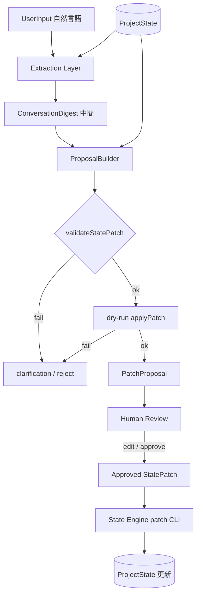

# GROUND Core v0.2 — Extraction Layer 設計

> **地位**: v0.1.1（State Engine / File Store / CLI）の上に載る **自然言語 → Patch 案** 変換層。  
> **v0.2 の位置づけ**: **設計 + 型 + mock + CLI propose**。LLM API 接続・自動保存は **v0.2 では行わない**。

---

## 0. 設計思想（再確認）

### 保存するもの / しないもの

| 保存する | 保存しない |
|----------|------------|
| ProjectState（幹・枝） | 会話全文 |
| 人間承認後の StatePatch | LLM 生出力 |
| （任意）PatchProposal ファイル | ConversationDigest の永続化（v0.2 では非推奨） |

**Conversation は StatePatch を作るための入力源にすぎない。**  
Extraction Layer は「提案工場」であり、State Engine は「確定更新工場」である。

### v0.2 の絶対ルール

1. **自動保存しない** — `propose` は PatchProposal を stdout / ファイル出力するだけ。`patch` は人間が明示実行。
2. **LLM 出力をそのまま保存しない** — 必ず `validateStatePatch` → `dry-run applyPatch` を通した `proposed_patch` のみを Proposal に含める。
3. **既存 ProjectState を参照** — Extractor は `loadProject(project_id)` した state を context として受け取る。
4. **confidence を出す** — 0.0–1.0。低 confidence または ambiguous なら patch ではなく clarification。
5. **高リスク操作は proposal に載せても requires_human_approval = true** — さらに risk_level: high では clarification を優先。

---

## 1. v0.2 全体アーキテクチャ

```
┌─────────────────────────────────────────────────────────────────┐
│  Interface Layer (v0.2: CLI only)                                │
│  propose / review-proposal / apply-proposal (apply = 既存 patch) │
└────────────────────────────┬────────────────────────────────────┘
                             │
┌────────────────────────────▼────────────────────────────────────┐
│  Extraction Layer (v0.2 新規)                                    │
│  ┌──────────────┐   ┌──────────────┐   ┌──────────────────────┐ │
│  │ UserInput    │ → │ Extractor    │ → │ ProposalBuilder      │ │
│  │ (raw text)   │   │ (interface)  │   │ validate + dry-run   │ │
│  └──────────────┘   └──────────────┘   └──────────────────────┘ │
│         │                    │                    │              │
│         │            ConversationDigest      PatchProposal       │
│         │            (中間、非永続)           (出力成果物)         │
└─────────┼────────────────────┼────────────────────┼──────────────┘
          │                    │                    │
          │         ┌──────────▼──────────┐         │
          │         │  ProjectState       │◄────────┘
          │         │  (loadProject)      │  context
          │         └──────────┬──────────┘
          │                    │
┌─────────▼────────────────────▼──────────────────────────────────┐
│  State Engine (v0.1.1 既存)                                      │
│  validateStatePatch → applyPatch (dry-run / 本適用)              │
└────────────────────────────┬────────────────────────────────────┘
                             │
┌────────────────────────────▼────────────────────────────────────┐
│  File Store (v0.1.1 既存)                                        │
│  saveProject — propose からは呼ばない                              │
└─────────────────────────────────────────────────────────────────┘
```

### 基本フロー



---

## 2. Extraction Layer の入出力

### 2.1 入力: `ExtractionInput`

| field | 型 | 必須 | 説明 |
|-------|-----|------|------|
| `raw_input` | string | ✓ | ユーザー自然言語（1発話単位。v0.2 は単ターン） |
| `project_id` | UUID \| null | △ | 明示指定。null なら project resolver が推定 |
| `project_state` | ProjectState | ✓ | `loadProject` 結果。Extractor はこれを読む |
| `project_catalog` | ProjectSummary[] | △ | 複数 project から推定する場合のみ |
| `locale` | string | — | デフォルト `ja` |
| `requested_at` | ISO8601 | — | 監査用 |

### 2.2 中間出力: `ConversationDigest`

Extractor が LLM / ルールで生成する **構造化メモ**。v0.2 では **永続化しない**（Proposal に embed 可、File Store には書かない）。

### 2.3 最終出力: `PatchProposal` | `ClarificationResponse`

| 結果 | 条件 |
|------|------|
| `PatchProposal` | patch 化可能、validate + dry-run 成功、confidence ≥ 閾値 |
| `ClarificationResponse` | ambiguous、project 不明、高リスクで判断保留、validate 不能 |

---

## 3. PatchProposal 型

```typescript
/** v0.2 — 人間レビュー待ちの Patch 案。ProjectState には書かない */
export interface PatchProposal {
  /** Proposal 自体の id（new-id で生成） */
  id: string;
  /** 対象 project */
  project_id: string;
  /** 元入力 */
  input_text: string;
  /** 人間向け要約（1–3 文） */
  summary: string;
  /** 0.0–1.0。Extractor + ProposalBuilder の合成 */
  confidence: number;
  /** 操作の危険度 */
  risk_level: "low" | "medium" | "high";
  /** validate 済み StatePatch。source は "extraction" */
  proposed_patch: StatePatch;
  /** dry-run applyPatch の結果サマリ */
  dry_run_result: DryRunResult;
  /** v0.2 では常に true */
  requires_human_approval: true;
  /** ambiguous 時の質問（patch 提案と併存可） */
  clarification_question?: string;
  /** 中間 digest（監査・デバッグ用、省略可） */
  digest?: ConversationDigest;
  /** 拒否理由（proposal 不成立時は ClarificationResponse 側） */
  rejection_reasons?: string[];
  created_at: string;
}

export interface DryRunResult {
  success: boolean;
  /** applyPatch 後の aggregate updated_at プレビュー */
  preview_updated_at: string;
  /** 変更される entity 種別と件数 */
  affected_entities: Partial<Record<PatchEntity, number>>;
  /** 操作ごとの before/after 要約（optional） */
  operation_summaries?: OperationSummary[];
  /** applyPatch / validate エラー */
  errors?: string[];
}

export interface OperationSummary {
  op: PatchOp;
  entity: PatchEntity;
  entity_id: string;
  label: string; // 例: "next_action: 配布場所を1つ決める → done"
}
```

### ClarificationResponse

```typescript
export interface ClarificationResponse {
  kind: "clarification";
  id: string;
  input_text: string;
  detected_project_id?: string;
  ambiguity_level: "low" | "medium" | "high";
  questions: string[];
  /** 参考 digest */
  digest?: ConversationDigest;
  /** 試みたが reject された patch（デバッグ用） */
  attempted_patch?: StatePatch;
  created_at: string;
}
```

---

## 4. ConversationDigest 型

```typescript
export type DetectedIntent =
  | "record_observation"
  | "complete_action"
  | "shift_primary_action"
  | "resolve_blocker"
  | "add_judgment"
  | "change_priority"
  | "pause_or_stop_project"
  | "add_reference_doc"
  | "unknown";

export interface ExtractedFact {
  kind: "location" | "decision" | "preference" | "emotion" | "status" | "other";
  text: string;
  confidence: number;
  maps_to_entity?: { entity: PatchEntity; entity_id?: string; field?: string };
}

export interface ConversationDigest {
  id: string;
  project_id?: string;
  raw_input: string;
  detected_project_id?: string;
  detected_intent: DetectedIntent;
  extracted_facts: ExtractedFact[];
  extracted_decisions: string[];
  extracted_observations: string[];
  extracted_possible_actions: string[];
  ambiguity_level: "low" | "medium" | "high";
  created_at: string;
}
```

**役割**: Extractor の思考を人間が読める形に落とす。Patch 操作へのマッピング根拠。

---

## 5. Extractor の責務

### 5.1 Interface

```typescript
export interface Extractor {
  readonly name: string; // "mock" | "template" | 将来 "openai"
  extract(input: ExtractionInput): Promise<ConversationDigest>;
}
```

### 5.2 責務分割

| コンポーネント | 責務 |
|----------------|------|
| **ProjectResolver** | `project_id` 未指定時、catalog + 入力から project 推定 |
| **Extractor** | raw_input + ProjectState → ConversationDigest |
| **PatchMapper** | Digest + ProjectState → StatePatch 草案（entity_id は state から解決） |
| **ProposalBuilder** | 草案 → validateStatePatch → dry-run applyPatch → PatchProposal |
| **RiskAssessor** | 操作内容から risk_level / clarification 要否 |
| **ConfidenceScorer** | intent 明確度、entity 解決率、FK 整合性から score |

### 5.3 Extractor が **やらない** こと

- `saveProject` / `applyPatch` 本適用
- 新 UUID の乱発（`new-id` は ProposalBuilder が操作ごとに明示生成）
- project 不在時の勝手な init
- 会話履歴の読み書き
- judgment / project.status の **無確認** 変更

### 5.4 PatchMapper の entity 解決規則

1. **next_action** — title の部分一致 + sort_order + primary_next_action_id を優先
2. **blocker** — title / description キーワード + `status: open`
3. **goal** — `primary_goal_id` または active goal 1 件
4. **observation** — 常に新規 upsert（source: `conversation`）
5. **judgment** — observation_id が確定できる場合のみ提案
6. **current_state** — `primary_next_action_id` のみ v0.2 初期 scope

---

## 6. Human Review の流れ

```
1. 人間: 自然言語入力
2. CLI propose → PatchProposal JSON（stdout または --out）
3. 人間: summary / proposed_patch / dry_run_result / clarification を読む
4. 必要なら patch JSON を手編集（entity_id・payload 修正）
5. 人間: npm run ground-core -- patch <id> --file approved.json
6. （任意）observation を「提案を承認した」旨で追記 — 別 patch
```

### レビュー観点チェックリスト

- [ ] `project_id` は意図した project か
- [ ] `proposed_patch.operations` の entity_id は実在するか
- [ ] `status_change: done` は本当に完了した作業か
- [ ] `primary_next_action_id` の移動先は depends_on を満たすか
- [ ] observation / judgment の body に過剰解釈がないか
- [ ] risk_level: high の操作（project pause, delete, blocker resolve 一括）を承認するか

### v0.2 に `review-proposal` コマンドは **設計のみ**

```bash
# 将来: proposal JSON を読み、人間向け diff 表示
npm run ground-core -- review-proposal --file proposal.json
```

v0.2 実装 scope では **pretty print + checklist 出力** まで。Web UI なし。

---

## 7. CLI での最小利用イメージ

### 7.1 propose（v0.2 新規）

```bash
# 基本: project 明示
npm run ground-core -- propose 28d83a68-2064-43d7-94cb-72656b9006de \
  --text "FreeWaterの配布場所、新宿中央公園にしようと思う"

# ファイル入力
npm run ground-core -- propose 839578f5-36e1-4b6f-9be5-a97520f52b66 \
  --file ./input.txt

# 出力先
npm run ground-core -- propose <project_id> --text "..." \
  --out ./proposals/2026-06-07-freewater-location.json

# mock extractor 明示（v0.2 デフォルト）
npm run ground-core -- propose <project_id> --text "..." --extractor mock

# project 推定（catalog から）
npm run ground-core -- propose --text "桃太郎はまずキャラ固定から" --auto-project
```

**stdout**: PatchProposal または ClarificationResponse の JSON  
**exit code**: 0 = proposal 成功、1 = clarification / エラー、2 = validation 失敗

### 7.2 既存 patch（変更なし — 人間承認後のみ）

```bash
npm run ground-core -- patch <project_id> --file ./approved-patch.json
```

### 7.3 典型セッション

```bash
# 1. 提案
npm run ground-core -- propose 28d83a68-... \
  --text "配布場所、新宿中央公園に決めた" \
  --out /tmp/fw-location-proposal.json

# 2. 人間が JSON 確認・編集
# 3. proposed_patch を抽出して保存
jq '.proposed_patch' /tmp/fw-location-proposal.json > /tmp/fw-location-patch.json

# 4. 本適用
npm run ground-core -- patch 28d83a68-... --file /tmp/fw-location-patch.json
```

---

## 8. v0.2 で作る範囲

| 項目 | 内容 |
|------|------|
| 型定義 | `extraction-types.ts` — PatchProposal, ConversationDigest, DryRunResult 等 |
| 設計 doc | 本ファイル |
| Prompt template 案 | `ground-core/extraction/prompts/` — LLM 接続前のテンプレート文字列 |
| Extractor interface | `extractor.ts` |
| Mock extractor | キーワード / fixture ベース。3 入力例をカバー |
| PatchMapper | digest → StatePatch 草案 |
| ProposalBuilder | validate + dry-run 包装 |
| RiskAssessor / ConfidenceScorer | ルールベースで十分 |
| CLI `propose` | mock のみ接続 |
| JSON Schema | `patch-proposal.v0.2.schema.json`（optional） |
| テスト | mock extractor + proposal builder + dry-run |

**schema_version**: ProjectState は **0.1.1 のまま**。Extraction は `ground-core/extraction/` に sub-module として追加。StatePatch の `source: "extraction"` を使用。

---

## 9. v0.2 で作らない範囲

| 項目 | 理由 |
|------|------|
| OpenAI / Anthropic API 接続 | v0.2.1+。まず mock で CLI フロー固定 |
| 自動保存 | 思想違反 |
| Web UI | Interface Layer 将来 |
| AI Router | Extension hooks のみ |
| PostgreSQL | File Store 継続 |
| full conversation memory | 葉は保存しない |
| background agent | 自動 propose / auto patch 禁止 |
| 自動判断 | judgment も proposal のみ |
| `review-proposal` の rich diff UI | テキスト checklist のみ |
| ProjectState schema 0.2.0 | entity 追加は別フェーズ |

---

## 10. 実装する場合のファイル構成案

```
ground-core/
  types.ts                          # 既存（StatePatch.source に extraction 済み）
  extraction/
    types.ts                        # PatchProposal, ConversationDigest, ...
    extractor.ts                    # Extractor interface
    mock-extractor.ts               # v0.2 デフォルト
    patch-mapper.ts                 # Digest → StatePatch
    proposal-builder.ts             # validate + dry-run
    dry-run.ts                      # load + applyPatch wrapper
    risk-assessor.ts
    confidence-scorer.ts
    project-resolver.ts             # --auto-project
    prompts/
      extract-digest.v0.2.txt       # LLM 用テンプレ（接続は v0.2.1）
      map-patch.v0.2.txt
    __tests__/
      mock-extractor.test.ts
      proposal-builder.test.ts
      examples.test.ts              # 3 入力例
  examples/
    proposals/
      freewater-location.proposal.json
      momotaro-priority.proposal.json
      freewater-quit.clarification.json
  cli.ts                            # propose サブコマンド追加
docs/
  GROUND_CORE_V0.2_EXTRACTION_DESIGN.md   # 本ファイル
  schemas/
    ground-core-patch-proposal.v0.2.schema.json
```

---

## 11. テスト方針

### 11.1 単体

| 対象 | 観点 |
|------|------|
| MockExtractor | 3 入力例で intent / facts が期待通り |
| PatchMapper | FreeWater state fixture 上で正しい entity_id 解決 |
| ProposalBuilder | validate 失敗時は ClarificationResponse |
| dry-run | applyPatch が throw しない、affected_entities 件数 |
| RiskAssessor | 「やめる」→ high + clarification |
| ConfidenceScorer | 曖昧入力 → score < 0.5 |

### 11.2 統合（CLI）

- `propose` が PatchProposal JSON を stdout
- `--out` ファイルが validate 可能
- propose 後に storage の project JSON が **変更されていない** こと（重要）
- 抽出した `proposed_patch` を `patch` に渡すと手書き patch と同等結果

### 11.3 Fixture

- `ground-core/__tests__/fixtures.ts` に FreeWater / Momotaro 最小 state
- `ground-core/examples/proposals/` に golden proposal JSON

### 11.4 非目標（v0.2 テスト）

- LLM API モック（v0.2.1）
- プロンプト回帰（snapshot のみ template 存在確認）

---

## 12. 危険パターンと拒否条件

### 12.1 危険パターン一覧

| # | パターン | 期待動作 | risk |
|---|----------|----------|------|
| D1 | 感情のみ（「だるい」「やめたい」） | observation + clarification。project stop しない | high |
| D2 | project.status → paused/archived/completed | proposal に載せず clarification | high |
| D3 | 未存在 entity_id 参照 | validate / dry-run fail → reject | high |
| D4 | delete 操作 | v0.2 mock では原則生成しない。必要なら high + 明示 | high |
| D5 | primary_next_action を done 済み action に | FK / 整合エラー → reject | medium |
| D6 | depends_on 未完了の action を primary に | warning + clarification | medium |
| D7 | 複数 project 混在入力 | auto-project で clarification | medium |
| D8 | 勝手な新 next_action 追加 | v0.2 scope 外 → clarification（追加は人間 patch） | medium |
| D9 | judgment outcome: stop/go を即確定 | FreeWater 例3: hold/revise proposal のみ | high |
| D10 | LLM hallucination で存在しない blocker 解消 | state に無い id → dry-run fail | high |
| D11 | observation body に個人情報 | テンプレで mask 推奨。v0.2 は警告のみ | medium |
| D12 | 一発話で 10+ operations | operation 上限（例: 8）超過 → reject | medium |

### 12.2 拒否条件（ClarificationResponse を返す）

1. `project_id` が解決できない（`--auto-project` でも confidence < 0.6）
2. `validateStatePatch(proposed_patch)` 失敗
3. `dry-run applyPatch` 失敗
4. `confidence < PROPOSE_THRESHOLD`（デフォルト 0.55）
5. `ambiguity_level === "high"` かつ intent が `pause_or_stop_project` | `unknown`
6. `risk_level === "high"` かつ clarification_question 未生成（ProposalBuilder バグ扱い）
7. 入力が空 / 5000 文字超

### 12.3 ProposalBuilder パイプライン（疑似コード）

```
digest = await extractor.extract(input)
patchDraft = patchMapper.map(digest, input.project_state)
patchDraft.source = "extraction"

if !validateStatePatch(patchDraft):
  return ClarificationResponse(...)

preview = dryRunApply(input.project_state, patchDraft)
if !preview.success:
  return ClarificationResponse(...)

risk = riskAssessor.assess(patchDraft, digest)
confidence = confidenceScorer.score(digest, patchDraft, preview)

if confidence < THRESHOLD || digest.ambiguity_level === "high":
  return ClarificationResponse(...) // attempted_patch 添付可

return PatchProposal({
  proposed_patch: patchDraft,
  dry_run_result: preview,
  requires_human_approval: true,
  risk_level: risk,
  confidence,
  clarification_question: risk === "high" ? "..." : undefined,
})
```

---

## 13. 想定入力例と期待 Patch Proposal

### 例 1: FreeWater 配布場所決定

**入力**: 「FreeWaterの配布場所、新宿中央公園にしようと思う」

**ConversationDigest（抜粋）**:

- intent: `record_observation` + `complete_action` + `shift_primary_action`
- facts: `{ kind: "location", text: "新宿中央公園", confidence: 0.9 }`
- maps_to: blocker「配布場所が未確定」、next_action `...3301`

**PatchProposal operations（案）**:

1. observation upsert — 「配布場所を新宿中央公園に決定しようとしている」
2. blocker `...2201` status_change → `mitigated` または `resolved`（human review で選択）
3. next_action `...3301` status_change → `done`
4. current_state upsert — `primary_next_action_id` → `...3302`

- judgment: 不要（または hold は人間判断）
- confidence: ~0.85
- risk_level: low

### 例 2: Momotaro 優先順位

**入力**: 「桃太郎はまずキャラ固定からやる。MJ文面は後でいい」

**PatchProposal operations（案）**:

1. observation upsert — 優先順位メモ
2. current_state upsert — `primary_next_action_id` → `c3333333-...3301`
3. MJ 文面 action（`...3304`）— **変更なし**（digest に explicit defer）

- confidence: ~0.8
- risk_level: low

### 例 3: FreeWater やめたい

**入力**: 「FreeWaterもうだるいからやめる」

**期待**: **ClarificationResponse**（または high risk PatchProposal + 強 clarification）

- observation proposal のみ: 感情・迷いを記録
- judgment proposal: `outcome: hold` または `revise`（**stop しない**）
- project.status 変更 **なし**
- questions: 「一時休止ですか？ Phase0 中止ですか？ 別 goal へ pivot ですか？」

---

## 14. Prompt template 案（v0.2 — 接続は v0.2.1）

### extract-digest.v0.2.txt（構造）

```
You are a state extraction assistant for GROUND Core.
You do NOT save state. You output JSON matching ConversationDigest schema.

Rules:
- Never invent entity UUIDs; use only IDs from PROJECT_STATE snapshot.
- If ambiguous, set ambiguity_level high and list questions.
- Do not propose project.status changes unless explicitly requested.
- Conversation is ephemeral; output structured digest only.

PROJECT_STATE:
{{project_state_json}}

USER_INPUT:
{{raw_input}}
```

### map-patch.v0.2.txt（構造）

```
Given ConversationDigest and PROJECT_STATE, output StatePatch operations only.
Use source "extraction". Max 8 operations.
Prefer: observation, status_change on next_action/blocker, current_state.primary_next_action_id.

DIGEST:
{{digest_json}}

PROJECT_STATE:
{{project_state_json}}
```

v0.2 では **ファイルとして置くのみ**。MockExtractor が同ロジックをルールで実装。

---

## 15. PatchProposal JSON 例

→ セクション 16 参照（FreeWater 配布場所）。  
ファイル例: `ground-core/examples/proposals/freewater-location.proposal.json`（実装時に追加）

---

## 16. 実装に進む前の確認ポイント

1. **PatchProposal を git にコミットするか** — proposal は作業成果物。`.gitignore` 対象か examples のみ commit か決める。
2. **PROPOSE_THRESHOLD デフォルト** — 0.55 でよいか。clarification 多すぎ問題。
3. **blocker resolve の op** — `status_change: resolved` vs `mitigated` の convention。
4. **observation の goal_id** — 常に `primary_goal_id` でよいか。
5. **--auto-project** — title 部分一致 + キーワードで十分か。
6. **operation 上限** — 8 でよいか。
7. **extractor name in patch metadata** — StatePatch に `extractor_meta` 拡張を v0.2 で許すか（extensions ではなく patch ルート optional field）。
8. **FreeWater / Momotaro fixture を test に載せる** — storage gitignore のため fixture 複製が必要。
9. **日本語のみ v0.2** — 英語入力は clarification でよいか。
10. **v0.2 完了定義** — mock propose → human patch → state 更新の E2E が通ること。

---

## 17. 関連ドキュメント

- [GROUND_CORE_V0.1_DESIGN.md](./GROUND_CORE_V0.1_DESIGN.md) — Extraction Layer 予告済み
- [GROUND_CORE_V0.1.1.md](./GROUND_CORE_V0.1.1.md) — 現行 schema
- [GROUND_CORE_CLI_V0.1.md](./GROUND_CORE_CLI_V0.1.md) — 既存 CLI
- [FREEWATER_GROUND_CORE_V0.1.1_PATCH.md](./FREEWATER_GROUND_CORE_V0.1.1_PATCH.md)
- [MOMOTARO_GROUND_CORE_V0.1.1_PATCH.md](./MOMOTARO_GROUND_CORE_V0.1.1_PATCH.md)

---

## 18. 付録: PatchProposal JSON 完全例（FreeWater 配布場所）

```json
{
  "id": "a1b2c3d4-e5f6-4789-a012-3456789abcde",
  "project_id": "28d83a68-2064-43d7-94cb-72656b9006de",
  "input_text": "FreeWaterの配布場所、新宿中央公園にしようと思う",
  "summary": "配布場所を新宿中央公園に決定する方向で、観測を記録し、配布場所決定 action を完了、次の primary action を「水2ケースとA4看板を用意する」に移す提案。",
  "confidence": 0.86,
  "risk_level": "low",
  "requires_human_approval": true,
  "proposed_patch": {
    "schema_version": "0.1.1",
    "project_id": "28d83a68-2064-43d7-94cb-72656b9006de",
    "source": "extraction",
    "operations": [
      {
        "op": "upsert",
        "entity": "observation",
        "entity_id": "NEW_UUID_1",
        "payload": {
          "id": "NEW_UUID_1",
          "project_id": "28d83a68-2064-43d7-94cb-72656b9006de",
          "goal_id": "f1111111-1111-4111-8111-111111111111",
          "title": "配布場所の検討",
          "body": "配布場所を新宿中央公園にしようとしている。",
          "source": "conversation",
          "observed_at": "2026-06-07T12:00:00.000Z",
          "created_at": "2026-06-07T12:00:00.000Z",
          "updated_at": "2026-06-07T12:00:00.000Z"
        }
      },
      {
        "op": "status_change",
        "entity": "blocker",
        "entity_id": "f2222222-2222-4222-8222-222222222201",
        "status": "mitigated"
      },
      {
        "op": "status_change",
        "entity": "next_action",
        "entity_id": "f3333333-3333-4333-8333-333333333301",
        "status": "done"
      },
      {
        "op": "upsert",
        "entity": "current_state",
        "entity_id": "5cd9d7bb-8464-4321-a2ee-603c3625e521",
        "payload": {
          "primary_next_action_id": "f3333333-3333-4333-8333-333333333302"
        }
      }
    ]
  },
  "dry_run_result": {
    "success": true,
    "preview_updated_at": "2026-06-07T12:00:00.010Z",
    "affected_entities": {
      "observation": 1,
      "blocker": 1,
      "next_action": 1,
      "current_state": 1
    },
    "operation_summaries": [
      {
        "op": "upsert",
        "entity": "observation",
        "entity_id": "NEW_UUID_1",
        "label": "observation: 配布場所の検討（新規）"
      },
      {
        "op": "status_change",
        "entity": "blocker",
        "entity_id": "f2222222-2222-4222-8222-222222222201",
        "label": "blocker: 配布場所が未確定 → mitigated"
      },
      {
        "op": "status_change",
        "entity": "next_action",
        "entity_id": "f3333333-3333-4333-8333-333333333301",
        "label": "next_action: 配布場所を1つ決める → done"
      },
      {
        "op": "upsert",
        "entity": "current_state",
        "entity_id": "5cd9d7bb-8464-4321-a2ee-603c3625e521",
        "label": "current_state: primary_next_action → 水2ケースとA4看板を用意する"
      }
    ]
  },
  "created_at": "2026-06-07T12:00:00.000Z"
}
```

※ `NEW_UUID_1` は実行時に `new-id` で置換。Proposal 出力時点で確定 UUID を入れる。

---

## 19. 付録: ClarificationResponse 例（FreeWater やめたい）

```json
{
  "kind": "clarification",
  "id": "b2c3d4e5-f6a7-4890-b123-456789abcdef",
  "input_text": "FreeWaterもうだるいからやめる",
  "detected_project_id": "28d83a68-2064-43d7-94cb-72656b9006de",
  "ambiguity_level": "high",
  "questions": [
    "「やめる」はプロジェクト全体の中止ですか？ それとも今日の配布だけ見送りですか？",
    "Phase0 を pause しますか？ それとも goal を revise しますか？",
    "感情メモを observation として残しますか？"
  ],
  "digest": {
    "id": "c3d4e5f6-a7b8-4901-c234-56789abcdef0",
    "project_id": "28d83a68-2064-43d7-94cb-72656b9006de",
    "raw_input": "FreeWaterもうだるいからやめる",
    "detected_intent": "pause_or_stop_project",
    "extracted_facts": [
      { "kind": "emotion", "text": "だるい", "confidence": 0.95 },
      { "kind": "status", "text": "やめたい", "confidence": 0.7 }
    ],
    "extracted_decisions": [],
    "extracted_observations": ["疲労・継続意欲の低下"],
    "extracted_possible_actions": ["observation 記録", "judgment hold/revise 提案"],
    "ambiguity_level": "high",
    "created_at": "2026-06-07T12:00:00.000Z"
  },
  "created_at": "2026-06-07T12:00:00.000Z"
}
```
