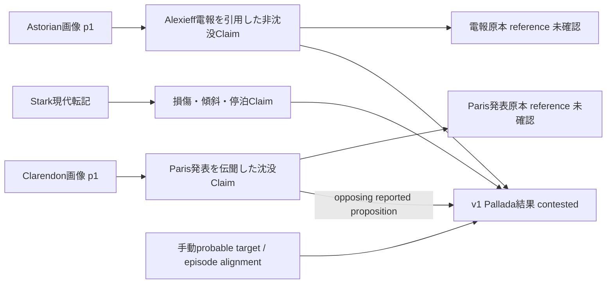

# Historical Reality / GROUND — Russo-Japanese War Round 4

対象：1904-02-08〜09、旅順口の初期軍事行動。前後の2月10〜16日の報告・刊行、および翌日の修理記述は、情報経路／状態記述のcontextに限定した。

**評価結果：experimental sidecarでは、食い違うSourceを保持しつつ、根拠・対立・依存・unknownを残したReconstruction v1を形成できた。既存coreへの完全な意味保存は未達であり、coreにはSource内容のClaimだけを部分投影した。Historical Event／State／政府Knowledgeは生成していない。**

これは「正しい戦闘経過」の確定版ではない。以下の「確認」は、明記しない限り、指定した表現物・箇所を実際に読めたという意味であり、原本真正性や外界の確定を含まない。

## 1. Confirmed Sources

* **日本側報告の写と図**：[JACAR C09050255300](https://www.jacar.archives.go.jp/das/meta/C09050255300)。Round 2取得PDFを再利用。海軍省-日露-M37-5、全53画像中、このRoundでは画像1〜7、16〜20を目視。画像1の「写」を確認した。東郷の海軍大臣宛報告、第二艦隊の報告、艦別被害、弾薬表、航跡・敵配置図がある。公文書館の画像だから原電報そのもの、とは扱わない。
* **ロシア側指揮官報告**：[Stark No.628](https://tsushima.su/RU/libru/i/Page_7/page_18/page_20/doc_stark/doc_stark_006/)、[Sevastopol艦長報告抜粋](https://tsushima.su/RU/libru/i/Page_7/page_18/page_20/doc_stark/doc_stark_016/)。表示されたロシア語転記を読んだ。PankrashkinのOCR creditがあり、原画像・原稿・公刊版との逐語照合は未実施。
* **艦別記録経路**：[Novik No.174](https://tsushima.su/RU/libru/i/Page_7/page_18/page_20/doc_stark/doc_stark_024/)。通常の取得が途中で切れたため、保存HTMLは不完全。冒頭の完結した段落のみ使用し、後半を読了扱いにしていない。艦船日誌そのものではない。
* **当事者の後年編集記述**：[Cherkasov本文](https://militera.lib.ru/memo/russian/cherkasov_vn/01.html)、[版・編集metadata](https://militera.lib.ru/memo/russian/cherkasov_vn/index.html)。2000年版のweb表現、印刷頁marker 17〜20と翌日修理contextを確認。夜間部分は「手紙から」とされるが、手紙原本は未確認。書名はPeresvetでも、このwindowの観測位置はSevastopolとして記述される。
* **同時代新聞のページ画像**：[Morning Astorian 1904-02-10 p.1](https://oregonnews.uoregon.edu/lccn/sn85042400/1904-02-10/ed-1/seq-1/)、[Clarendon Chronicle 1904-02-10 p.1のPDF](https://newspapers.swco.ttu.edu/server/api/core/bitstreams/8ee25498-d4a8-42e0-8d4e-a6f2d31511d3/content)。両紙の1頁を目視した。新聞の刊行物画像であり、引用された電報・Paris発表の原本ではない。
* **依存とmodalityのcontrol**：[現代英語Togo再掲](https://losthistory.net/russojapanesewar/togo-aar1.html)、[JACAR現代解説](https://www.jacar.go.jp/exhibition/nichiro2/sensoushi/kaijou_01_detail.html)、[Te Papa O.005101目録](https://collections.tepapa.govt.nz/object/272298)。前二者を独立戦闘観測として数えない。最後はmetadataだけを確認し、写真自体は未確認。

新規10 Sourceに加え、Round 2の日本報告Sourceを再利用した。取得したPDF全体と読んだ頁の範囲は別である。原資料未確認は解消していない。

## 2. Event candidates

6候補をSource単位で残した：日本夜間、ロシア夜間、日本昼間、ロシア艦長昼間、Paris伝聞夜間損害、Cherkasov昼間観測。

4つの手動関係を追加した。夜間同士／昼間同士は`probably_same_episode_as`、同じ日本報告内の夜間と昼間は`distinct_episode_from`。Paris伝聞とロシア夜間損害の対応は、隣接記述の艦・攻撃方式・旅順口という文脈からprobableとした。Pallida/Palladaの文字列一致だけではない。

関係の粒度は**広い交戦episode**である。最初の爆発、各魚雷命中、各砲撃を同一Eventに統合していない。無条件の`same_event_as`やcanonical Eventは不要と判断した。

## 3. Japanese observations / reports

東郷の写は、夜間攻撃を「9日午前0時」、昼間の接近を「9日午前十時」、戦闘を正午頃・約40分として分けている。10時を砲戦開始と読めば、存在しない時刻対立を作ってしまう。[報告画像](https://www.jacar.archives.go.jp/das/meta/C09050255300)

夜間成果には「少くとも」「ポルタワ型」「認む」がある。艦型の推定を確定したPoltava艦名へ変換しない。Askoldその他の命中判断も、敵船体を後日検査した結果とは違う。Claimは判定者とqualifierを保持した。

画像2は日本艦隊の戦死4、負傷53、軽微な損傷、戦闘力減少なしという報告。画像3の2月10日付と、画像1の仁川11日発電というheaderは別の時間roleである。詳細な艦別報告が揃っていないというscopeも保持した。

第二艦隊の正午台の発砲時刻記述（分の字は判読未確定）、敵戦艦6・巡洋艦5、第二戦隊の戦死0、弾薬表、図は艦隊全体のKnowledgeと同一化しない。画像16は上村から東郷へ、2月16日付の部下艦長報告を含むcompiled report。宛名から東郷の受領・読了日時を生成しなかった。

## 4. Russian observations / reports

Starkは旗艦当直日誌と艦長報告から編成したと明記する。最初のRetvizan爆発を1月26日23:35、旗艦で聞いたとしている。当初は自軍魚雷の事故だと解釈し、Tsesarevich、続いてPalladaのsignalが疑いを解いた、という後からの指揮官記述である。signalの送信・受信・解釈の正確な時刻はunknown。[Stark転記](https://tsushima.su/RU/libru/i/Page_7/page_18/page_20/doc_stark/doc_stark_006/)

Novikの完結した冒頭段落では、23:45砲声を聞いたが艦が視界を遮り原因を識別できず、翌日00:10に旗艦から汽醸・追撃命令を受け、00:30に出航したとされる。浮遊するWhitehead魚雷と木片の観測は、発射艦や命中数の確定ではない。[不完全な現代表現の所在](https://tsushima.su/RU/libru/i/Page_7/page_18/page_20/doc_stark/doc_stark_024/)

Sevastopol艦長は10:40の初期12隻に4巡洋艦が加わり、11:08敵が発砲、11:13旗艦signal、11:15行動、11:45自艦12吋砲射撃停止、と記す。Cherkasovは23:45砲声、戻った艇員の魚雷損害報告、無線でPalladaの被雷を知ったこと、11:25自艦付近の初弾を記す。各々の報告・伝聞・観測を分けた。[艦長抜粋](https://tsushima.su/RU/libru/i/Page_7/page_18/page_20/doc_stark/doc_stark_016/)、[編集memoir](https://militera.lib.ru/memo/russian/cherkasov_vn/01.html)

ロシア海軍全体、Stark個人、旗艦観測者、Novik command、Cherkasov個人は別scopeである。

## 5. Third-party observations

AstorianのChefoo記事には英国汽船Columbiaが旅順から到着し、Novikと日本艦隊の間に位置し、周囲の砲弾／甲板への着弾を伝えた記述がある。外国船起源の観測**として報道されたもの**は保持できたが、目撃者氏名・船の日誌・原電はない。[当日の新聞画像](https://oregonnews.uoregon.edu/lccn/sn85042400/1904-02-10/ed-1/seq-1/)

同頁の「海軍士官」は氏名・所属不明で、Columbiaの乗員や英国士官と同定しない。Flug/Alexieffの引用は第三者紙面に載った公式報告の反復であり、外国人による独立観測ではない。Round 1のFRUS公式電報経路も引き続き外交官自身の戦闘目撃へ変換しない。

## 6. Source dependencies

Round 3 lineageをそのまま使用した。

* 日本写→未確認の元報告。現代英語再掲は日本報告との部分対応を確認したが、直接この写から翻訳したという制作経路は未証明。`claims_to_reproduce`として限定した。
* JACAR解説→C09050255300への明示的参照。現代chartは別の歴史観測ではない。
* Stark→旗艦日誌／艦長報告という著者のdependency assertion。引用先原本はreference endpointに留める。
* Astorian→Flug/Alexieff電報引用、Clarendon→未確認のParis発表への伝聞。
* Cherkasov編集本文→版metadata／未確認の手紙。Te Papa目録→未確認の写真。

12 lineage、9 unverified reference。citation、partial correspondence、original identity、独立観測は別の問題として保持した。

## 7. Independent corroborations

広い夜間魚雷攻撃と昼間交戦には、敵対する日本・ロシアの著者／組織起源がある。その範囲では独立した起源からの支持があると評価した。ただし転記の隠れた共通編集源まで検証できておらず、「完全に独立した一次証拠が何本」とは数えない。

Starkとその編成元、Togoと英語／guide、Sevastopol艦長と同艦にいたmemoir著者を、単純な加算でcorroboration増加にしていない。Columbiaは別の報告起源の候補であり、原ログ未確認を残す。独立性は5件の**命題scope付き評価**で、Sourceの恒久属性ではない。

## 8. Direct contradictions

ClarendonはParisの仏外務省がPallida沈没を発表したと伝え、Astorianのロシア公式電報引用はPalladaを含む被雷3艦を非沈没としている。[Clarendon頁](https://newspapers.swco.ttu.edu/server/api/core/bitstreams/8ee25498-d4a8-42e0-8d4e-a6f2d31511d3/content)、[Astorian頁](https://oregonnews.uoregon.edu/lccn/sn85042400/1904-02-10/ed-1/seq-1/)

**同じ対象・夜間損害を指すというprobable alignmentを条件にした、reported propositions間の直接否定**である。双方の「Sourceがそう述べた」というClaimは同時に成立できるため、coreのsource-content Claim間へ無条件のCONTRADICTSを投影していない。

StarkのPallada停泊・傾斜記述も非沈没を支持するが、Paris発表の原本未確認を多数決で消さなかった。実際の沈没結果はv1でcontested。

## 9. Apparent contradictions resolved into scope / perspective differences

* 23:35爆発／23:45砲声：別actor・別observable。
* 10時接近／正午砲戦：別の時間role。
* 11:08敵発砲／11:25自艦近くの初弾：射撃と局所到達の違い。
* 日本艦隊戦死4／第二戦隊戦死0：actor scopeの包含関係。
* 夜間日本側無損傷／昼間艦隊軽損傷：phase・unitが異なる。
* 最初の12隻／後続4隻加入：同時の12対16という矛盾ではない。Boyarinの8→11 smoke cuesも時刻の異なるsignalで、船体数ではない。

再照合で第二艦隊の報告scopeと第二戦隊の死傷者表scopeを分けた。画像7の分の字は、初期の12:07暫読を確認できず撤回した。原画像と初期／最終抽出のcorrectionを保存し、確実なsource-contentへ昇格しなかった。「分を読めない」は上村のClaimではなくcurrent systemのinspection diagnosticとして明示した。

解消し切れない例も残した。Sevastopolの3傷者と「funnel fragmentsは誰にも当たらず」は傷害カテゴリーが違う可能性がある。Petrovのfragment対porthole/concussionという機序は医療原記録がなく、完全なscope解消とはしていない。

## 10. Temporal disagreements

日本写「9日午前0時」と英語「midnight on the8th」、現代chartの00:28は統一しなかった。英語は夜の日付の表現境界、chartは後の再構成であり、時計を校正する証拠ではない。[写](https://www.jacar.archives.go.jp/das/meta/C09050255300)、[英語再掲](https://losthistory.net/russojapanesewar/togo-aar1.html)、[現代chart](https://www.jacar.go.jp/exhibition/nichiro2/sensoushi/kaijou_01_detail.html)

ロシア表記1月26／27日にJulian暦を**条件付きで**適用すると13日加算で2月8／9日となる。個別転記の暦慣行・艦内標準時が未確認なので、rawを残し、確定Gregorian時刻やUTC instantは保存していない。No.628／174の「6 February」も、window内の2月6日Gregorianと自動解釈しなかった。

昼間の日本の正午台（分未確定）・正午頃とロシア11:08は、roleとclock標準が異なるまま。平均値や1時間の固定補正を作っていない。guideの12:45 ceaseと本文14時過ぎdepartureは、editorial wording／role差を含む未解決比較。関連資料captionの9日／10日も後代記述の不一致として保持した。

## 11. Spatial disagreements

旅順外港というnamed area、旗艦とRetvizanの約3cablesというrelative position、艦隊航跡図のdiagram-relative position、30〜45cablesというapproximate rangeを保持した。

図の敵位置・艦名が不確かという記載は、図の線を正確な座標として使わない根拠になる。Astorian公式報告の南方退出と匿名士官のDalny方向「最後に見た」は、観測時刻・位置・bearing frameが不明なため、論理矛盾とも同一進路とも確定しない。8 spatial records全てcoordinates=null。

## 12. Quantity disagreements

* **日本傷者53対54**：写の負傷53は明瞭。英語再掲は54。translation／transcription／edition段階のどこで生じたかunknown。同じ報告系統から世界の正しい傷者数を決めない。
* **日本昼間艦数15対16**：Cherkasov15と匿名士官16。Sevastopol艦長は初期12＋後続4。観測時刻・coverage・分類の違いがあり得るが、確定原因はunknown。
* **Astorian見出し3損傷対本文4艦列挙**：update、scope、編集のどれか不明。削除せずinternal quantity disagreement。
* **Astorian死傷者**：海軍死者9＋陸上1で見出し10は説明できる。海軍傷者51名＋士官2名＋陸上3名は56で、見出し54に一致しない。死者scopeの説明を傷者へ自動拡張しなかった。
* **OCR correction**：匿名士官の艦数はweb OCRでは18に見えるが、新聞画像は16と読める。訂正はSource text抽出についてであって、外界に16隻いたという訂正ではない。

23 quantity recordsには魚雷少なくとも8、命中3、攻撃艇少なくとも4、伝聞による日本駆逐艦沈没2〜3、Pallada傾斜4.5度、自艦12吋弾10／6吋弾62、whaleboatの穴60を含む。「穴60」→「砲弾命中60」を禁止した。弾薬表の未照合の訂正セルは総計へ換算しない。

## 13. Damage / state-change reconstruction

Sevastopolは艦長報告とmemoirが後部煙突損傷を述べる。艦長は6または8吋弾、煙突周囲の約三分の一、boatの穴等を記す。砲撃・14時停泊というoperational actionと、翌1月28日のmemoir修理記述を別のstate descriptorにした。[艦長](https://tsushima.su/RU/libru/i/Page_7/page_18/page_20/doc_stark/doc_stark_016/)、[memoir](https://militera.lib.ru/memo/russian/cherkasov_vn/01.html)

Beforeの完全な健全状態はunknown。Afterの損傷はreported damage。停泊・運用継続は完全な戦闘能力の証明ではなく、翌日の屋根用鉄板・針金という修理回想はrepair order／work logではない。

Palladaは損傷・傾斜・停泊を報告された一方、沈没伝聞が対立する。日本側は東郷の「戦闘力減ぜず」という自己評価を保存するが、独立測定のconfirmed capabilityではない。6 state recordsは全て非canonical。

## 14. Historical Event Reconstruction v1

7命題を一つの独立versionに保存した。

1. 広い夜間魚雷攻撃：**probable**。敵対する報告起源と局所砲声で支持、正確なstart／標的同定はunknown。
2. その後の昼間surface engagement：**probable**。両側の報告に支持、時計・初弾・停止瞬間は未同期。
3. Pallada/Pallida沈没結果：**contested**。非沈没／停泊支持と沈没伝聞を両方保持、対象alignmentはprobable。
4. 正しい日本傷者数：**unresolved**。写53／英語54はsource-contentとして明瞭、独立casualty auditがない。
5. 正確な日本昼間艦数：**contested**。15／16／時間差を伴う12＋4を残す。
6. Sevastopolのreported funnel damage：**probable**。before／完全capability／傷害機序／original repair recordはunknown。
7. actor-specific event knowledgeの疎な経路：**possible**。明示された受信・解釈・報告・発電・刊行の箇所だけ再構成可能。

各命題にsupporting／contradicting Claim IDs、dependency record参照、時間・場所の不確かさ、source identity／content／reality certainty、alternatives、rationaleを付した。statusは校正された確率ではない。v1の意味を変更した場合は拒否し、新しい命題IDと次versionを追加する。

## 15. Supporting / contradicting Evidence graph

実データのbasis traversalは142件全て根拠Sourceに到達した。[全trace](/Users/macsaku/seiri-ai-frontend/ground-core/experimental/historical-reality/round4/replay/evidence-traces.json)、[v1](/Users/macsaku/seiri-ai-frontend/ground-core/experimental/historical-reality/round4/replay/reconstruction-v1.json)、[contrast](/Users/macsaku/seiri-ai-frontend/ground-core/experimental/historical-reality/round4/replay/contrasts.json)。

Pallada部分の読み方：

これは世界のEvent graphではない。Source→Claim→Evidence／dependency→Reconstructionという現在の評価graphである。

Event Knowledge側は、旗艦の初期解釈→signalで解釈更新というStarkの記述、Novik00:10 order receipt、Cherkasovの無線によるlearning、東郷2月10日報告付／11日dispatch inscription、上村16日作成・宛名、新聞10日刊行の8段階記録を保持した。

source-created、addressed、dispatched、publishedからheadquarters receipt／minister reading／government awarenessへedgeを足していない。conditional calendarのNovik orderはqueryでunplaced。2月16日compiled reportを2月9日のKnowledgeへ遡及させない。空の政府queryはignoranceの証拠ではない。

## 16. New Semantic Gap Signals

[SG-27〜35](/Users/macsaku/seiri-ai-frontend/ground-core/experimental/historical-reality/round4/semantic-gap-signals.json)：episode identityの粒度、observer perspective／partial view、spatial precision、quantity unit／scope、proposition-scoped corroboration、未知beforeを含む状態記述、reported proposition対立とversioning、catalogue／image／dateのmodality boundary、不完全表現とOCR correction。

いずれも上記実例でlost meaningを確認した。万能なidentity solver、source reliability score、spatial probability modelは導入していない。

## 17. Repeated Round 1〜3 gaps

timeroles、nested attribution、actor scope、source existence≠possession≠read≠knowledge、sparse stages、dependency、reference endpoint、unknown reasons、三つのcertainty target、documentary／historical／knowledge domainの分離を再確認した。SG-02/03/06/07/11/13/14/15/16/18/19/21/23/24/25/26の意味境界が軍事資料でも必要だった。

弱められた点：Round 3で「別modalityでactor scopeを試す必要」とした保留理由は、この狭い軍事caseに限って解消された。外交専用の意味ではなかった。

修正・限定した点：lineageだけからindependence全般を決めるのは不足する。命題・観測範囲ごとのassessmentが必要。document custodyのstage enumを軍事知覚の閉じた語彙へ一般化できない。source-clock差に見える比較の一部は、実際にはobservable／role差である。過去datasetを書き換えて訂正したのではなく、Round 4の評価として追加した。

## 18. Experimental substrate changes

[設計理由とalternatives](/Users/macsaku/seiri-ai-frontend/ground-core/experimental/historical-reality/round4/README.md)、[実装](/Users/macsaku/seiri-ai-frontend/ground-core/experimental/historical-reality/round4/reconstruction.ts)。

Historical case→existing string／day／lineage representation→lost role/unit/alignment/version→最小record extension→validator→tests→serialization→reload→root traversal→legacy compatibility、という経路を記録した。

変更はRound 4 envelopeと13種類のcase-tagged record、immutable version契約に限定。Round 3のdocumentary validator／traceをadapterで再利用。各recordはClaim basis、依存record、description、limitを持つ。quantity／time／spaceはworld value／UTC／座標の自動生成を拒否。direct negationは opposite reported propositionと手動alignmentを要求する。

汎用record detailsはexperimentalであり、閉じたtyped ontologyとして完成したとは主張しない。既存Claimへの自由属性だけという案は、unit／role／basis queryを保証できないため採用しなかった。core変更、単一Event統合、数値confidenceによる勝者選択は不要だった。

## 19. Dataset additions

[Round 4 dataset](/Users/macsaku/seiri-ai-frontend/ground-core/experimental/historical-reality/round4/round4.dataset.json)は独立version。新規24 Actor、10 Source、83 Claim、83 evidence relation。継承後は67 Actor、42 Source、147 Claim、149 relation。

103軍事case records：6 event candidate、4 alignment、6 attributed observation、11 time、8 space、23 quantity、16 contrast、5 independence、6 state、8 knowledge stage、2 silence、1 modality boundary、7 reconstruction。別に39 documentary records、10 search / inspection diagnostics、17 assets、1 reconstruction version。

Round 1〜3 datasetとRound 1 landscapeをSHA256 pinで検証した。親dataset hash：

* Round 1 `5bc32592aa80ee4742f8e01b09d4381dacc1ce080fb930772a7a1ea2b24c70c2`
* Round 2 `8fa0c1087b1945dfcbc1aa991c014d2b44796e4e4667eb3243d5a9a27d097d3c`
* Round 3 `3f5da8eaee7ef0683abe9d3cf3c35b965b1e798f7458910a02cccc6f30418714`

## 20. Tests / replay / provenance validation

[Round 4 tests](/Users/macsaku/seiri-ai-frontend/ground-core/__tests__/historical-reality-round4.test.ts)、[verification](/Users/macsaku/seiri-ai-frontend/ground-core/experimental/historical-reality/round4/verification.json)、[replay](/Users/macsaku/seiri-ai-frontend/ground-core/experimental/historical-reality/round4/replay.ts)。

実行済み：Round 4 **22/22**、継承Round 1〜3＋epistemic／reconciliation／gaps／worldline **83/83**、計**105/105**。ground-core TypeScript check成功。sidecar serialize/reload/materialize equality、142 derived source traversals、10 diagnostic traversals、31 assets（親14＋今回17）のsize/hash/magic検証、canonical file-store reloadを実施した。

意味境界のtestsは、source-content certaintyとcontested reality、conditional direct negation、raw calendars、different observables、scope、unit、未知before、partial view、photo year interval、政府queryのabsence non-inference、v1変更拒否／v2追加、provenance cycle拒否を含む。

core部分投影の147 Claimsは全てSource内容についてのClaimで、historical Events **0**／States **0**。継承した0.95 confidenceはtext attributionの未校正推定値であり、Reality certaintyではない。legacy code/core schema変更 **0**。これらは参照整合性と意味保存の検証であり、歴史原本の真正性確認ではない。

## 21. Unresolved Reality / evidence

原本当直日誌、各艦報告原稿、引用されたFlug/Alexieff電報、Paris発表、Cherkasov手紙、修理work recordを未確認。Sourceが失われた・archiveが不完全、とまでは判定していない。

正確な攻撃start／clock standard、各魚雷target／hit／日本駆逐艦損失、Poltava-typeから固有艦への対応、Pallada沈没伝聞の原意、正しい艦数／傷者数、Petrov傷害機序、図のexact position、政府／海軍省のreceipt/read timeはunknownまたはcontested。Novik後半の完全な現代表現も取得できていない。

Te Papaはimage／caption／exposure date／locationを確認していない。createdDate January1を撮影日へ昇格しなかった。後代公式戦史はguideの参照先までで、原頁未確認。これらのmissing分類とsearch scopeは保存済みで、「見つからない」を「存在しなかった」に変換していない。

## 22. Core Promotion Candidates

[8候補のA〜F評価](/Users/macsaku/seiri-ai-frontend/ground-core/experimental/historical-reality/round4/promotion-watch.json)。全候補でA今回必要、C外交専用ではない、Dこの軍事caseにも適用、E歴史だけに限定しない、F GROUND全体への適用は有望だが非歴史datasetでは未検証、とした。

**candidateにするのは安定した最小境界だけ**：

* actor+payloadを持つepistemic attribution。Bは変わらず、ship／observer scopeが追加された。ActorのKnowledge真偽を自動決定するprimitiveではない。
* raw temporal representation＋role＋precision＋unknown conversion。Bの基本分離は安定、observable alignment／時計校正は追加課題。
* provenanceの明示的upstream endpoint＋evidence scope。Bのendpoint境界は安定、independenceは別の命題評価へ限定した。
* certaintyの明示的対象：source identity／inspected source contentをexternal realityと分ける契約。Bは安定、写真のdepicted identityとは別対象。
* unknownのtarget＋reason＋search／inspection scope。Bは安定、欠落からabsenceへ進めない。

information propagation stageは疎なattributionとして一般化したが、Bは知覚・解釈との接続で変化し、語彙固定はwatch。reality certaintyは別対象という境界こそ安定しているが、status scale／確率校正／更新lifecycleはwatch。頻度だけでcandidateにせず、意味境界を限定した。core変更はしていない。

## 23. Concepts too immature to promote

exact/probable Event identity solver、universal stage enum、source-level independence score、source reliability ranking、空間確率分布、数量の自動truth reconciliation、損傷→戦闘力の変換、全てのcontradictionを網羅する閉じたtaxonomy、数値reality confidence、historical Knowledge worldlineの自動生成、catalogue→image/event認定。

versioningの必要性は確認したが、version間の正当なretraction・supersession・部分更新を一般化する契約はまだ試していない。既存core BeliefAssessmentと歴史actorのbeliefも同一化しない。

## 24. Recommended Round 5 target

**同じ旅順初期windowを保ち、被雷艦一隻の原画像付き艦長報告／当直日誌／損傷調査・修理記録と、その指揮官／政府への受領記録を縦に追う。第一候補Pallada、原資料到達性が低ければRetvizan。**

今回のreported-sinking conflictに、真正性・版・観測時刻を確認したstate／receipt Evidenceを足し、v1を残してv2を作る。校正されたclock／calendar conversion、dependencyを跨ぐ独立支持、later correctionとscope difference、before／after／capabilityを重点検証する。資料への到達ができなければunknownとして残す。戦争全体へ拡大しない。

**最終判定：食い違いを消さないReconstructionはsidecarで可能だった。広いepisodeの支持、明示的な対立、scopeで解消する見かけの対立、同一情報の反復、原本・時計・Knowledgeのunknownを再読込可能な構造として保持した。coreだけではこの意味を完全に保持できず、今回の成功はexperimental substrate込みでの結果である。**
