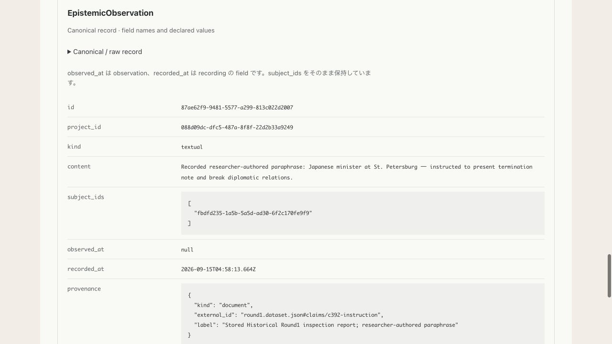
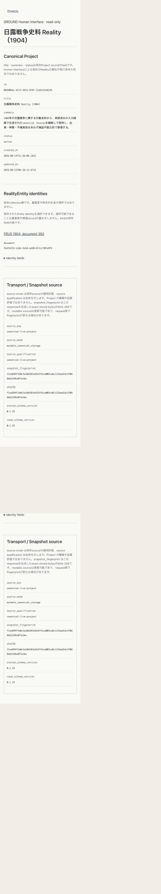

# HUMAN-004C — Live Browse / Explorer UI Proof

Baseline: HUMAN-004B `9d35ff8f135f14c7cc244cda98623a1b52e8c330`.
Remote `ground/human-004b` was pushed and verified as exactly this commit.
Checkpoint: GROUND Human Interface — Mutable Canonical Read Boundary v0.
C branch/worktree: `ground/human-004c`, `/private/tmp/ground-human-004c`.

## Implementation boundary

Only Browse.jsx, RealityReadView.jsx, live-ui.test.tsx and these Human Interface
verification docs/images change. No server contract, source resolver, registry,
core, storage, schema, fixture, canonical data or CSS changes. Existing responsive
CSS sufficed. No new canonical read scope or source-specific component exists.

Catalog displays project_id, source_key, source_mode, source_qualification for
3 immutable proofs plus the explicitly enabled mutable source. It remains an
unloaded registration catalog; no canonical title/count/fingerprint/schema is
asserted there. Modes use the same field treatment, without quality ranking.
Project/Entity transport displays snapshot_fingerprint as exact stored bytes
SHA-256, independently of canonical fields. Proof fixture verification wording
is conditional on immutable source mode; live is never called a verified fixture.
Existing sha256 compatibility fields remain in server transport/raw disclosures.

Project shows saved title, summary, status, timestamps, identity-only Entity list,
stored/read schema, mode, qualification and fingerprint. Entity shows the existing
canonical record and readers. No count/activity/importance is added to Entity links.
Evidence notes explicitly limit the path to Claim-linked bundles and exclude
Observation→Evidence traversal; they do not assert absence of Evidence.

Live runtime/config/root/file/validation/identity/permission failures use generic
scope-limited error explanations. No unavailable source becomes a zero-record
Project. No client path/config selector, pinning, diff, history, polling, refresh
button, graph, timeline or operator control is added.

## Actual browser proof (2026-09-15)

Local Express preview used the unchanged B HTTP router and C Vite UI together at
`http://localhost:3004`, with `GROUND_RUNTIME_CONFIG` explicitly pointing to the
existing STORAGE-003 runtime JSON. No prior server was switched or killed.
The temporary launcher and delay control are outside the repository and are not
product behavior. The normal preview delay is zero.

Performed actual browser clicks, beginning at `/reality`:

1. Confirm all four registered scopes and separate mode/qualification fields.
2. Click live Project `088d09dc-dfc5-487a-8f8f-22d2b33a9249`.
3. Confirm canonical title `日露戦争史料 Reality（1904）`, stored summary/status/timestamps,
   one Entity identity, and distinct Transport / Snapshot source region.
4. Click `FRUS 1904, document 392` (`document`), Entity
   `fbdfd235-1a5b-5a5d-ad30-6f2c170fe9f9`.
5. Confirm EpistemicObservation 1; Claim/Event/State 0 in this Entity read scope,
   empty core Worldline entries, with Observation kept separate.
6. Expand the actual Observation raw record. Confirm ID
   `87ae62f9-9481-5577-a299-813c022d2007` and exact content:
   `Recorded researcher-authored paraphrase: Japanese minister at St. Petersburg — instructed to present termination note and break diplomatic relations.`
7. Confirm `observed_at: null` remains null, and `recorded_at` remains
   `2026-09-15T04:58:13.664Z`, without renaming either role.
8. Confirm provenance kind `document`, external_id
   `round1.dataset.json#claims/c392-instruction`, label
   `Stored Historical Round1 inspection report; researcher-authored paraphrase`.
9. Back to Project, repeat Entity click at 390×844, expand raw, scroll through
   content/null/recorded_at/provenance; reload; revisit Catalog and live Project.
   DOM width and scrollWidth both 390; long fields wrap without horizontal overflow.
   Reset viewport afterward. No CSS change required.
10. Same-server proof regression: HUMAN-001 FRUS392 (Claim 1, linked bundle 1);
    B15 enduring target (Event 1, State 2, Observation 2, entries 4);
    Round4 FRUS392 (Claim 1) and `第2艦隊戦闘詳報(1) C09050255300`
    (Claim/bundles 23, one unique linked Evidence). Modes/qualifications retained.
11. Temporary preview-only 5-second response delay: Project and Entity transitions
    showed only their loading status, no previous Project/Entity content. Restored
    delay to zero. Existing scope-keyed state/abort guards are unchanged.

Project and Entity transport fingerprints matched:
`f1ed694f3e0c3a10d383e816f43ca003cd6c123dad18c3f0688d2289c0f3e3bc`.
This is response bytes identity only, not Reality version or temporal current state.
Future requests may differ after an authorized writer publish; no auto-error or
cross-route transaction is introduced.

## No-write audit

Before and after browser navigation, raw expansion, back/revisit and reload,
SHA-256 compared equal for all 12 protected assets: actual Project, root manifest,
runtime JSON, and every existing LIVE-003C operations file (receipt, prepared
receipt, recovery metadata, exact before bytes, operation script and verification
artifacts). Final Project fingerprint equals the expected value above.
No owner session, save, migration writeback, cleanup, manifest/temp/lock change or
operations update was performed by the Human Interface. No source was restored.

Canonical storage has Evidence `3151b313-d5bc-5b58-a17d-a61add22f22d` (1 record).
Current Entity read returns Claim-linked bundles 0. The UI does not fetch, display
or hardcode the standalone Evidence; it also does not report Project Evidence 0.

## Verification and semantic gate

98 tests PASS / 0 FAIL: B server/registry/resolver/boundary tests, Browse and Entity
UI tests, new source-mode/fingerprint/Evidence/error wording tests, and relevant
file-store/storage-owner tests. Typecheck adapter/core PASS; Human Interface lint
PASS; Vite build PASS; Foundation PASS. Full core suite not rerun because core and
storage are unchanged; existing 104 missing-fixture failures are not repaired.

Browser and tests establish field visibility, source separation, read-scope wording
and no-write behavior. They do not establish third-party comprehension. No display
asserts historical truth, executed instruction, exact quote, authenticated source,
identified observer, observation absence from null, proof/live quality ordering,
Reality version identity, Evidence absence, or Observation-as-Event.

HUMAN-004C has no blocking issue. HUMAN-004D is not required to fix this proof;
if designated next, independent comprehension/semantic review is a reasonable
checkpoint. Next canonical read-scope candidate is Observation-linked Evidence,
requiring separate authorization/design. Neither D nor that traversal was started.
