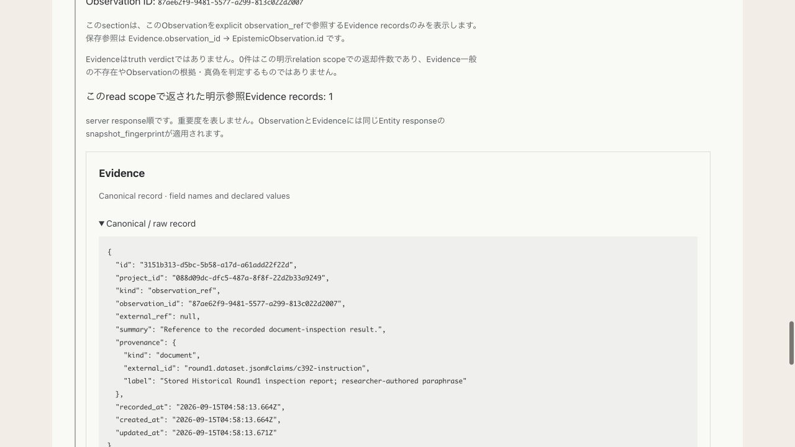
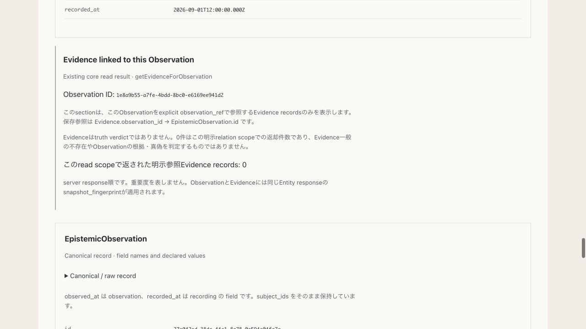
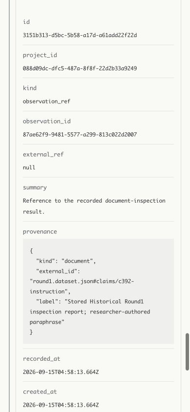

# HUMAN-005C — Observation-linked Evidence UI

Baseline B commit c99d085ed326c03d9232802b17427a06e00c9f21 was pushed to
origin/ground/human-005b and remote exact equality verified. Checkpoint:
GROUND Human Interface — Observation-linked Evidence Read Boundary v0.
C branch/worktree: ground/human-005c, /private/tmp/ground-human-005c.

## UI boundary

RealityReadView places an `Evidence linked to this Observation` section immediately
after each existing EpistemicObservation panel. It selects the already returned
bundle by observation_id; no canonical Evidence search/filter is implemented in
UI. Core/server/resolver/HTTP contract and canonical schema/types remain unchanged.
Browse UI and Claim-linked Evidence presentation are unchanged.

The relation section shows Observation ID, explicit stored reference direction
Evidence.observation_id → EpistemicObservation.id, scoped returned count and all
Evidence records in server response order. Each Evidence uses existing RecordPanel,
including id, project_id, kind, observation_id, external_ref, summary, provenance,
recorded_at, created_at, updated_at. A single disclosure click opens full raw JSON.
No truth-oriented renaming, provenance comparison or source authenticity claim.

Zero Evidence still has a visible section and says:
`このread scopeで返された明示参照Evidence records: 0`.
It does not mean Evidence absence or unsupported Observation. A missing bundle is
shown as an unavailable read result, never invented as zero. Zero Observations
produce no per-Observation relation sections. Multiple Evidence records are mapped
without sorting, selection or identity replacement. Claim-linked bundles remain
under Claims; no generic Project Evidence list is created.

Observation and Evidence share the existing Entity response snapshot_fingerprint.
No Evidence fingerprint, backlink, request, external_ref lookup, provenance
traversal, index, write/action or Historical-specific viewer is introduced.

## Browser proof

Localhost:3005 served the unchanged B HTTP router and C Vite UI with the existing
STORAGE-003 runtime JSON explicitly supplied through GROUND_RUNTIME_CONFIG.
The separate preview launcher lives outside the repository. HMR uses a separate
port to avoid other running previews. No other server was replaced.

Actual browser click paths:

- `/reality` Catalog (proof 3 + live 1) → live Project → FRUS 1904, document 392
  → EpistemicObservation → Evidence linked to this Observation → raw expansion.
- Projects → B15 → Controlled enduring target (not an Event) → both Observation
  sections → explicit Evidence counts 0 and 1.
- Projects → live Project → Document again → browser reload → same Evidence raw.

Live Project 088d09dc-dfc5-487a-8f8f-22d2b33a9249:
Document fbdfd235-1a5b-5a5d-ad30-6f2c170fe9f9;
Observation 87ae62f9-9481-5577-a299-813c022d2007;
Evidence 3151b313-d5bc-5b58-a17d-a61add22f22d.
The browser displayed kind observation_ref, exact observation_id, external_ref null,
summary `Reference to the recorded document-inspection result.`, stored provenance
and timestamps. Raw opened in one operation. No source inspection or new authority
was inferred from this display.

B15 Observation 1e8a9b55-a7fe-4bdd-8bc0-e6169ee941d2 displayed a zero-result section.
Observation 27e042ed-38da-44c1-8a78-0a594e04fa7a displayed Evidence
731d5de8-f456-4f4d-8de0-2b5b6627ee13. Both remained under their own Observation.
No unsupported/unverified badge, Event attachment or truth verdict was generated.

At 390×844, inspected Observation → relation heading → Evidence fields, summary,
observation_id, provenance and raw. Width and scrollWidth were both 390, including
expanded raw. Long IDs and values wrapped within their fields. Viewport reset.

## Tests and no-write audit

Combined B server/core plus UI suite: 104 PASS / 0 FAIL, with one opt-in live test
skipped when config is absent. Then the dedicated UI file ran with explicit live
config: 5 PASS / 0 FAIL, including that actual live test. This covers all 105 unique
tests across the two runs (four overlap). Cases cover live 1/1, B15 1/0, Historical
zero Observations, multiple response items in stored order, missing-bundle behavior,
raw fields, relation wording, existing Claim UI and all four source boundaries.

Core/adapter typechecks, Human Interface lint, Vite build and Foundation PASS.
No core/server semantic changes, so full core suite not rerun. B's measured baseline
remains 3,792 PASS / 104 known missing-fixture FAIL; C does not claim a new full run.

Before/after browser clicks, raw expansion, revisit and reload, hashes matched for
all 12 protected files: Project, root manifest, runtime config and existing LIVE-003C
operations files including receipt, prepared receipt and recovery before bytes.
Project fingerprint remained:
`f1ed694f3e0c3a10d383e816f43ca003cd6c123dad18c3f0688d2289c0f3e3bc`.
No owner session, save, migration writeback, cleanup or operations update occurred.

## Semantic gate and remaining limits

Display establishes the explicit observation_ref relation and preserves canonical
fields/identity; it does not establish truth, source authenticity, historical Event
confirmation or Claim equivalence. Zero denotes only this relation scope's returned
count. Same provenance is shown without same-authority inference.

No blocking issue. Actual remaining evidence gaps include independent third-party
comprehension and an existing saved case with multiple Evidence referring to one
Observation (multi-item presentation is tested, not claimed as a new Reality proof).
These are candidates for later discovery/audit, not grounds to fabricate records or
add scope. HUMAN-006 is not required to complete this checkpoint; its objective
should be chosen separately. HUMAN-006 was not started.
