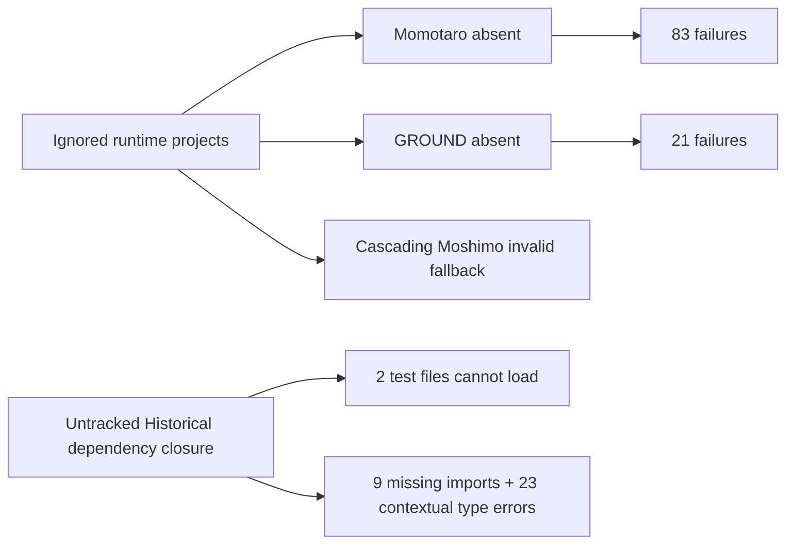

# GROUND-REPRO-001 — clean checkout contract

Base: `d10ad1419e5a6ab857247a4ac153e459256274c5` (Phase4B plus bounded Phase5).
No successor Phase5 semantics or Human Interface changes are included.

## Reproduce

Use Node.js 24.15.0 / npm 11.12.1 (the measured environment; package.json's
engine constraint remains unchanged). From any fresh checkout of this branch:

```sh
npm ci
node node_modules/typescript/bin/tsc -p ground-core/tsconfig.json
node node_modules/typescript/bin/tsc -p scripts/repro/tsconfig.json
npm run test:ground-core
npm run build
git status --porcelain
```

`npm run test:ground-core` creates a unique OS temporary directory, copies the
repository's source/test/evidence roots there **without** `ground-core/storage`,
and generates four test projects from versioned inputs. Tests execute in that
directory; the caller's runtime store is neither read nor written. The directory,
fixture digests and exit status are printed/retained for inspection. Installed
dependencies are linked from this same checkout, not another worktree. The runner
does not read `.env`, access services, or restore production state. `tsx` CLI
subprocess tests require local IPC permission in sandboxed environments.

No setup against a real runtime directory is needed. The internal setup command
requires an explicit test-workspace marker and refuses to overwrite project files.
Runtime `storage/projects` stays ignored. Seven narrowly named legacy test scratch
directories are also ignored; new runs leave their scratch outputs in OS temp.

## Baseline root causes

An unmodified fresh checkout of the base produced 3,803 tests: 3,697 pass, 106
fail, zero skipped/cancelled. The failure census is exhaustive:

- Momotaro `839578f5-36e1-4b6f-9be5-a97520f52b66` unavailable: 83 failures.
- GROUND `34092589-569a-4eec-923d-a105b6b1402c` unavailable: 21 failures
  (including the direct runtime-store checksum read in reconcile tests).
- Missing Historical source dependency closure: 2 entire test files fail to load.

These are two packaging root causes (Historical artifacts and legacy test setup),
or three unavailable input groups when distinguishing the two project identities.
They are not 106 independent semantic defects. The typecheck diagnostics are nine
TS2307 missing-module errors and 23 cascading TS7006 contextual-type errors.
No generated declaration or branch-divergence type repair was needed.

Restoring these inputs also exposes a pre-existing Moshimo fallback fixture bug:
it changes the outer project but retains FreeWater child owners. A fixture from
the existing versioned Moshimo seed makes the original test's valid input branch
available. The fallback and all original assertions remain byte-identical.



## Historical provenance and adoption

182 missing files, 90,124,602 bytes, are adopted byte-for-byte from the preserved
local evidence snapshot. Every adopted byte hash matches a **pre-existing**
Round5, Round6 or Round7 immutable-baseline entry. `historical-artifacts.json`
lists paths, sizes, hashes, roles, pin witnesses and reference candidates.
`round7-pin-witness.json` retains the unmodified subsequent checkpoint manifest
that pins Round6. Existing Round5/6 manifests and intake approvals are unchanged.
Matching frozen checkpoints, parent dataset hashes, preserved reports and replay
proofs establish the artifact lineage; filesystem timestamps alone are not used.
Individual human versus agent authorship is not inferable from untracked files.

The adopted closure includes Round1–6 sources, datasets, acquired evidence,
replay proofs/reports and Round1–4 tests missing from the repository. Large PDFs
and proof outputs are retained because the existing contract checks their exact
bytes; they are not runtime storage or invented fixture data. Later Round7–11
work was inventoried/snapshotted externally, but is not added to this base.

No original Historical semantics, canonical implementation, test expectation,
schema or migration is edited. The existing frozen source checks still run.
The additional proof compares Round6 materialized dataset, 87 source traversals,
40 queries and canonical Source/Claim/Evidence content against archived replay.
For canonical replay only `created_at`/`updated_at` bookkeeping fields are
excluded; all attribution, stable IDs, event times, unknowns and relationships
remain in the comparison. Dataset and trace comparisons are exact.

## Test fixture source and equivalence boundary

1. Momotaro: `momotaro-production-design.patch.json` followed by
   `momotaro-v0.1.1-manual.patch.json`.
2. GROUND: `ground-core-manual-run.patch.json` followed by
   `ground-core-v0.4-state-update.patch.json`.
3. FreeWater: existing `freewater-phase0.project.json`, unchanged bytes.
4. Moshimo: existing `moshimo-first-episode.v0.1.0.json` experiment seed, with
   deterministic test UUIDs that consistently rebind all owner/reference edges.

The first two follow the already documented master-branch preparation method;
the runner now separates the generated copies from runtime storage. Existing
nullable legacy dependency defaults are filled in setup, not production code.
Generated technical creation/update clocks are fixed to a fixture instant;
explicit decision/observation times in manual patches survive. Moshimo's seed
creation/decision clocks are synthetic test clocks, not historical occurrences.

The current live GROUND project is newer (`v0.6_dogfood`) than the versioned v0.4
test examples, and live Momotaro has an extra conversation observation. Thus
whole current runtime states are **not** asserted equal to these fixtures.
Production histories are neither copied into Git nor removed. Equivalence is
scoped to the documented test checkpoint and the unchanged test-visible
contract: all 200 legacy storage-dependent tests pass both on snapshot copies
of local runtime fixtures and on the generated versioned fixtures. The complete
canonical-content differences are retained in the external audit. The fresh
suite includes all original tests, without skips or expectation edits.

An independent comparison to the existing master worktree's prepared test
fixtures found zero differences for Momotaro, GROUND and FreeWater across all
13 legacy content fields after excluding technical creation/update clocks.
Schema wrappers and later empty collections are reported separately; this does
not erase differences in the current production/dogfood states.

Two independent generator processes must produce identical byte digests. The
additional checks also verify owner relationships, primary goal/action references,
dependency references, collision refusal and every historical adoption hash.

## Boundary and remaining work

This repair proves the reproducibility of the specified d10ad14 checkpoint plus
its missing frozen Historical dependency closure. It does not integrate later
Phase5 work, later Historical checkpoints, Human Interface or IMMUNE. It does
not claim that every ignored production project's full history is regenerable.
The complete external inventory preserves those unknowns instead of inventing
generators. No source remote is changed and no push is performed.

See `REPORT.md` for measured fresh-export/worktree proofs and final commit state.
